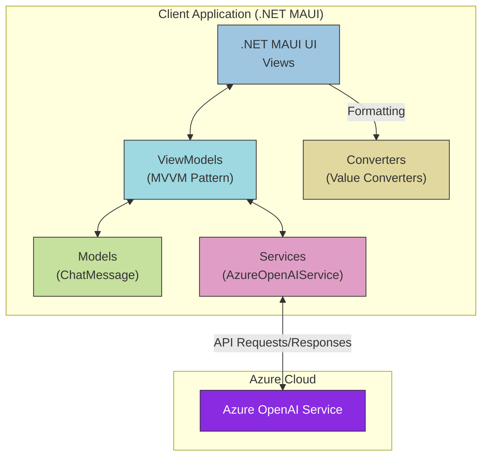
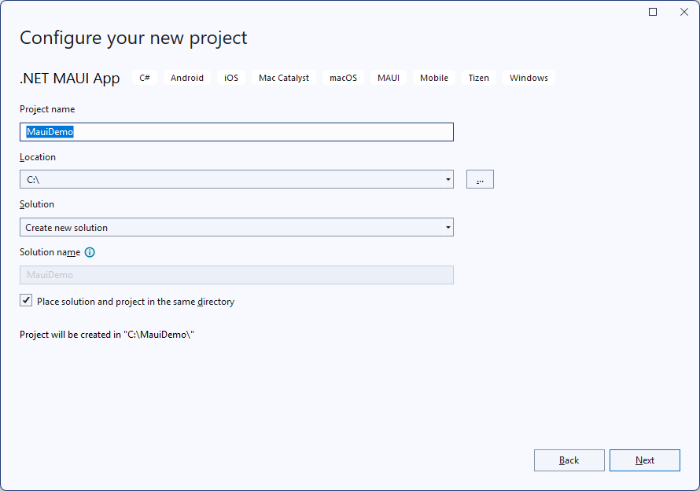
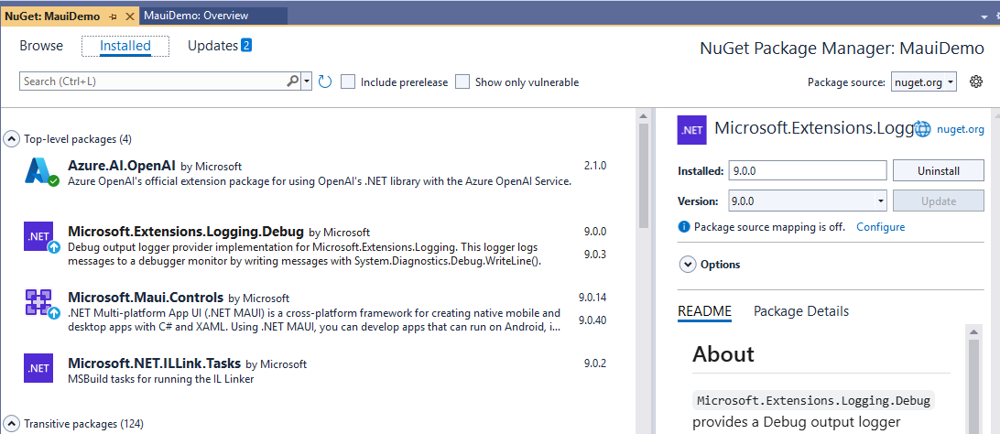
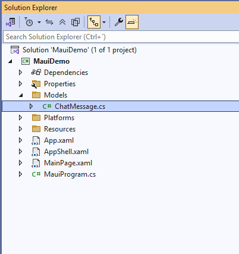
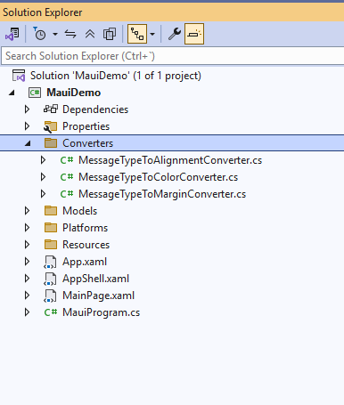
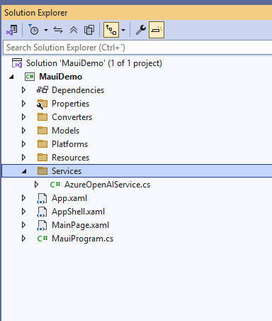
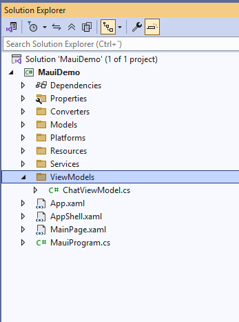
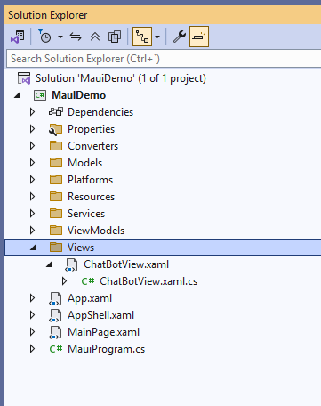
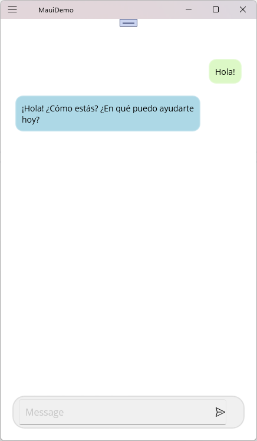
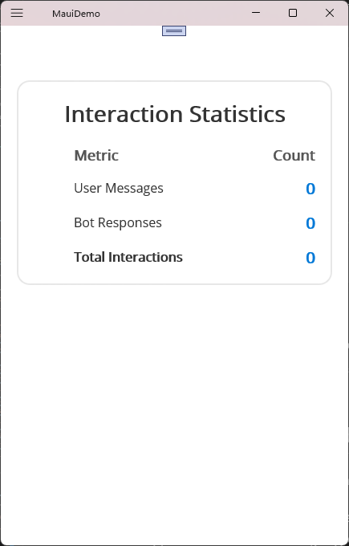

# .NET MAUI Azure OpenAI Chat Application Lab

## Overview

This lab guides you through creating a chat application using .NET MAUI and Azure OpenAI. The application provides a conversational interface where users can interact with an AI assistant powered by Azure OpenAI.

## Application Architecture



The diagram above illustrates the application architecture and data flow:
- **Views**: XAML UI components that display the chat interface
- **ViewModels**: Implement the MVVM pattern to manage UI logic and state
- **Models**: Define data structures like ChatMessage
- **Services**: Handle communication with Azure OpenAI
- **Converters**: Transform data for UI presentation
- **Azure OpenAI Service**: External cloud service providing AI chat capabilities

## Prerequisites
 * Visual Studio 2022 with .NET MAUI workload installed
 * Azure account with OpenAI service enabled
 * Basic understanding of C# and XAML

## Laboratory Objectives
By the end of this laboratory, you will be able to:
1.	Create a .NET MAUI project structure
2.	Implement the MVVM pattern
3.	Design a responsive chat interface
4.	Integrate with Azure OpenAI services
5.	Implement asynchronous messaging functionality

## Step 1: Creating the Project Structure
1.	Open Visual Studio 2022
2.	Click on "Create a new project"
3.	Search for "MAUI" and select ".NET MAUI App" template
4.	Name the project "MauiDemo" and click "Create"

5.	Verify that the created project targets .NET 9 and includes necessary platforms (Android, iOS, macOS, Windows)

## Step 2: Setting Up the Project Dependencies
1.	In Solution Explorer, right-click on the project and select "Manage NuGet Packages"
2.	Install the following packages in this order:

    a. **Azure.AI.OpenAI** (version 2.2.0-beta.2 or later)
       - Click on the "Browse" tab
       - Search for "Azure.AI.OpenAI"
       - Select the package and click "Install"
       - This package enables communication with Azure OpenAI services
       - Make sure to select version 2.2.0-beta.2 or later as it contains the required ChatCompletionsOptions functionality

    b. **Microsoft.Extensions.Logging.Debug** (latest version compatible with .NET 9)
       - This package is required for debug logging functionality
       - Usually installed by default with the .NET MAUI template

3. If you encounter any package dependency resolution issues:
   - Check that your project targets .NET 9
   - Try closing and reopening Visual Studio
   - Clear the NuGet cache (Tools > NuGet Package Manager > Package Manager Settings > Clear All NuGet Cache(s))
   - Restart Visual Studio and try installing the packages again

    

## Step 3: Creating the Models
1.	Create a new folder in the project called "*Models*"
2.	Create a new class file called "ChatMessage.cs" with the following code:

```csharp
namespace MauiDemo.Models
{
    public enum MessageType
    {
        User,
        Bot
    }

    public class ChatMessage
    {
        public string Text { get; }
        public MessageType Type { get; }
        public DateTime Timestamp { get; }

        public ChatMessage(string text, MessageType type)
        {
            Text = text;
            Type = type;
            Timestamp = DateTime.Now;
        }
    }
}
```
 

This class represents messages in our chat application, distinguishing between user messages and bot responses.

## Step 4: Creating the Value Converters
1.	Create a new folder called "Converters"
2.	Create a new class file called "MessageTypeToColorConverter.cs"  to handle the chat UI formatting:

```csharp
using MauiDemo.Models;
using System.Globalization;
namespace MauiDemo.Converters
{
    public class MessageTypeToColorConverter : IValueConverter
    {
        public object Convert(object value, Type targetType, object parameter, CultureInfo culture)
        {
            if (value is MessageType messageType)
            {
                return messageType switch
                {
                    MessageType.User => Color.FromArgb("#DCF8C6"),
                    MessageType.Bot => Colors.LightBlue,
                    _ => Colors.Gray
                };
            }
            return Colors.Gray;
        }

        public object ConvertBack(object value, Type targetType, object parameter, CultureInfo culture)
        {
            throw new NotImplementedException();
        }
    }
}
```
 
MessageTypeToAlignmentConverter.cs:
```csharp
using MauiDemo.Models;
using System.Globalization;
namespace MauiDemo.Converters
{
    public class MessageTypeToAlignmentConverter : IValueConverter
    {
        public object Convert(object value, Type targetType, object parameter, CultureInfo culture)
        {
            if (value is MessageType messageType)
            {
                return messageType switch
                {
                    MessageType.User => LayoutOptions.End,
                    MessageType.Bot => LayoutOptions.Start,
                    _ => LayoutOptions.Center
                };
            }
            return LayoutOptions.Center;
        }

        public object ConvertBack(object value, Type targetType, object parameter, CultureInfo culture)
        {
            throw new NotImplementedException();
        }
    }
}
```

MessageTypeToMarginConverter.cs:
```csharp
using MauiDemo.Models;
using System.Globalization;
namespace MauiDemo.Converters
{
    public class MessageTypeToMarginConverter : IValueConverter
    {
        public object Convert(object value, Type targetType, object parameter, CultureInfo culture)
        {
            if (value is MessageType messageType)
            {
                return messageType switch
                {
                    MessageType.User => new Thickness(80, 5, 10, 5),
                    MessageType.Bot => new Thickness(10, 5, 80, 5),
                    _ => new Thickness(10, 5)
                };
            }
            return new Thickness(10, 5);
        }

        public object ConvertBack(object value, Type targetType, object parameter, CultureInfo culture)
        {
            throw new NotImplementedException();
        }
    }
}
```

  

These converters will be used to format the chat messages based on their type (user or bot).

## Step 5: Creating the Azure OpenAI Service
1.	Create a "Services" folder in the project
2.	Add a new class called "AzureOpenAIService.cs" with the following code:

```csharp
using Azure;
using Azure.AI.OpenAI;
using OpenAI;
using OpenAI.Chat;
using System.ClientModel;

namespace MauiDemo.Services;

public class AzureOpenAIService
{
    private readonly string _endpoint;
    private readonly string _key;
    private readonly string _deploymentName;
    private readonly AzureOpenAIClient _client;
    private readonly ChatClient _chatClient;

    public AzureOpenAIService(string endpoint, string key, string deploymentName)
    {
        _endpoint = endpoint;
        _key = key;
        _deploymentName = deploymentName;

        _client = new(
            new Uri(_endpoint),
            new ApiKeyCredential(_key));

        _chatClient = _client.GetChatClient(_deploymentName);
    }

    public async Task<string> GetCompletionAsync(List<ChatMessage> messages)
    {
        try
        {
            ChatCompletion completion = await _chatClient.CompleteChatAsync(messages);
            return completion.Content[0].Text;
        }
        catch (Exception ex)
        {
            return $"Error: {ex.Message}";
        }
    }
}

```
   

This class encapsulates the logic for interacting with the Azure OpenAI service to get chat completions based on the provided messages.

## Step 6: Creating the ViewModel

1.	Create a "ViewModels" folder in the project
2.	Add the ChatViewModel.cs file as shown in your code:

```csharp
using MauiDemo.Models;
using MauiDemo.Services;
using OpenAI.Chat;
using System.Collections.ObjectModel;
using System.ComponentModel;
using System.Runtime.CompilerServices;
using System.Windows.Input;
using ChatMessage = MauiDemo.Models.ChatMessage;

namespace MauiDemo.ViewModels
{
    public class ChatViewModel : INotifyPropertyChanged
    {
        private readonly AzureOpenAIService _openAIService;
        private readonly List<OpenAI.Chat.ChatMessage> _messages;
        private string _userInput;
        private bool _isBotTyping;
        private ChatMessage _lastMessage;

        public ObservableCollection<ChatMessage> Messages { get; }
        public ICommand SendMessageCommand { get; }

        public string UserInput
        {
            get => _userInput;
            set
            {
                if (_userInput != value)
                {
                    _userInput = value;
                    OnPropertyChanged();
                }
            }
        }

        public bool IsBotTyping
        {
            get => _isBotTyping;
            set
            {
                if (_isBotTyping != value)
                {
                    _isBotTyping = value;
                    OnPropertyChanged();
                }
            }
        }

        public ChatMessage LastMessage
        {
            get => _lastMessage;
            set
            {
                if (_lastMessage != value)
                {
                    _lastMessage = value;
                    OnPropertyChanged();
                }
            }
        }

        public ChatViewModel(AzureOpenAIService openAIService)
        {
            _openAIService = openAIService;
            Messages = new ObservableCollection<ChatMessage>();
            SendMessageCommand = new Command(async () => await SendMessage());

            _messages = new List<OpenAI.Chat.ChatMessage>
            {
                new SystemChatMessage("You are a helpful assistant.")
            };
        }

        private async Task SendMessage()
        {
            if (string.IsNullOrWhiteSpace(UserInput))
                return;

            var userMessageText = UserInput.Trim();

            // Add user message to UI collection
            var userMessage = new ChatMessage(userMessageText, MessageType.User);
            Messages.Add(userMessage);
            LastMessage = userMessage;

            // Add message to OpenAI context
            _messages.Add(new UserChatMessage(userMessageText));

            // Clear input
            UserInput = string.Empty;

            // Show typing indicator
            IsBotTyping = true;

            // Get response
            string response = await _openAIService.GetCompletionAsync(_messages);

            // Hide typing indicator
            IsBotTyping = false;

            // Add bot response to UI collection
            var botMessage = new ChatMessage(response, MessageType.Bot);
            Messages.Add(botMessage);
            LastMessage = botMessage;

            // Add bot response to OpenAI context
            _messages.Add(new AssistantChatMessage(response));
        }

        public event PropertyChangedEventHandler PropertyChanged;

        protected virtual void OnPropertyChanged([CallerMemberName] string propertyName = null)
        {
            PropertyChanged?.Invoke(this, new PropertyChangedEventArgs(propertyName));
        }
    }
}
```
    

This class represents the ViewModel for the chat application, handling user input, message processing, and interaction with the Azure OpenAI service.

## Step 7: Creating the Chat Interface
1.	Create a "Views" folder in the project if it doesn't exist
2.	Right-click on the Views folder, select Add > New Item
3.	Under .NET MAUI choose ".NET MAUI Content Page (XAML)" and name it "ChatBotView.xaml"
4.	Replace the content with the following XAML:

```xml
<?xml version="1.0" encoding="utf-8" ?>
<ContentPage xmlns="http://schemas.microsoft.com/dotnet/2021/maui"
             xmlns:x="http://schemas.microsoft.com/winfx/2009/xaml"
             xmlns:models="clr-namespace:MauiDemo.Models"
             xmlns:viewmodels="clr-namespace:MauiDemo.ViewModels"
             x:Class="MauiDemo.Views.ChatBotView"
             x:DataType="viewmodels:ChatViewModel"
             Title="ChatBotView">

    <Grid Padding="10">
        <Grid.RowDefinitions>
            <RowDefinition Height="*" />
            <RowDefinition Height="Auto" />
        </Grid.RowDefinitions>

        <!-- Scrollable area containing the conversation -->
        <CollectionView x:Name="MessageList"
                        Grid.Row="0" 
                        ItemsSource="{Binding Messages}"
                        Margin="0,0,0,10">
            <CollectionView.ItemTemplate>
                <DataTemplate x:DataType="models:ChatMessage">
                    <Grid Padding="5">
                        <Border BackgroundColor="{Binding Type, Converter={StaticResource MessageTypeToColorConverter}}"
                                Stroke="{Binding Type, Converter={StaticResource MessageTypeToColorConverter}}"
                                StrokeShape="RoundRectangle 12"
                                StrokeThickness="1"
                                Padding="10"
                                HorizontalOptions="{Binding Type, Converter={StaticResource MessageTypeToAlignmentConverter}}"
                                Margin="{Binding Type, Converter={StaticResource MessageTypeToMarginConverter}}">
                            <Label Text="{Binding Text}"
                                   TextColor="Black"
                                   LineBreakMode="WordWrap" />
                        </Border>
                    </Grid>
                </DataTemplate>
            </CollectionView.ItemTemplate>
            <CollectionView.Footer>
                <Grid IsVisible="{Binding IsBotTyping}">
                    <Label Text="Bot is typing..." 
                           TextColor="Gray" 
                           Margin="15,0,0,5"
                           HorizontalOptions="Start" />
                </Grid>
            </CollectionView.Footer>
        </CollectionView>

        <Grid Padding="10" Grid.Row="1">
            <Border BackgroundColor="#F0F0F0" StrokeShape="RoundRectangle 20" Padding="10,5" HorizontalOptions="Fill">
                <Grid>
                    <Entry Text="{Binding UserInput}"
                           Placeholder="Message" 
                           TextColor="Black"
                           FontSize="16" 
                           VerticalOptions="Center" 
                           Margin="0,0,20,0"
                           ReturnCommand="{Binding SendMessageCommand}"/>

                    <Button Command="{Binding SendMessageCommand}"
                            BackgroundColor="Transparent" 
                            WidthRequest="40" 
                            ImageSource="search.png" 
                            HeightRequest="40" 
                            HorizontalOptions="End" 
                            VerticalOptions="Center" />
                </Grid>
            </Border>
        </Grid>
    </Grid>
</ContentPage> 

```
This XAML defines the chat interface layout, including the conversation area, message formatting, and user input controls.


5.	Create the associated code-behind file "ChatBotView.xaml.cs" with the following content:

```csharp
using MauiDemo.Models;
using MauiDemo.Services;
using MauiDemo.ViewModels;

namespace MauiDemo.Views;

public partial class ChatBotView : ContentPage
{
    private ChatViewModel _viewModel;

    public ChatBotView(AzureOpenAIService openAIService)
    {
        InitializeComponent();
        _viewModel = new ChatViewModel(openAIService);
        BindingContext = _viewModel;

        // Subscribe to property changes for LastMessage
        _viewModel.PropertyChanged += ViewModel_PropertyChanged;
    }

    private void ViewModel_PropertyChanged(object sender, System.ComponentModel.PropertyChangedEventArgs e)
    {
        if (e.PropertyName == nameof(ChatViewModel.LastMessage) && _viewModel.LastMessage != null)
        {
            // Scroll to the last message
            ScrollToLastMessage();
        }
    }

    private void ScrollToLastMessage()
    {
        if (_viewModel.Messages.Count > 0)
        {
            MessageList.ScrollTo(_viewModel.Messages.Count - 1, position: ScrollToPosition.End, animate: true);
        }
    }

    protected override void OnAppearing()
    {
        base.OnAppearing();
        // Ensure we scroll to the last message when the page appears
        ScrollToLastMessage();
    }
}

```
    

This code-behind file sets the ViewModel as the binding context for the view and ensures that the entry field gets focus when the page appears.

## Step 8: Registering Resources and Services
1.	Open App.xaml and add the following Resource Dictionary:

```xml
<?xml version = "1.0" encoding = "UTF-8" ?>
<Application xmlns="http://schemas.microsoft.com/dotnet/2021/maui"
             xmlns:x="http://schemas.microsoft.com/winfx/2009/xaml"
             xmlns:local="clr-namespace:MauiDemo"
             xmlns:converters="clr-namespace:MauiDemo.Converters"
             x:Class="MauiDemo.App">
    <Application.Resources>
        <ResourceDictionary>
            <ResourceDictionary.MergedDictionaries>
                <ResourceDictionary Source="Resources/Styles/Colors.xaml" />
                <ResourceDictionary Source="Resources/Styles/Styles.xaml" />
            </ResourceDictionary.MergedDictionaries>

            <converters:MessageTypeToColorConverter x:Key="MessageTypeToColorConverter" />
            <converters:MessageTypeToAlignmentConverter x:Key="MessageTypeToAlignmentConverter" />
            <converters:MessageTypeToMarginConverter x:Key="MessageTypeToMarginConverter" />

        </ResourceDictionary>

    </Application.Resources>
</Application>

```
2.	Open MauiProgram.cs to register services and view models:
```csharp
using Microsoft.Extensions.Logging;
using MauiDemo.Services;
using MauiDemo.Views;

namespace MauiDemo;

public static class MauiProgram
{
    public static MauiApp CreateMauiApp()
    {
        var builder = MauiApp.CreateBuilder();
        builder
            .UseMauiApp<App>()
            .ConfigureFonts(fonts =>
            {
                fonts.AddFont("OpenSans-Regular.ttf", "OpenSansRegular");
                fonts.AddFont("OpenSans-Semibold.ttf", "OpenSansSemibold");
            });

        // Register Azure OpenAI service
        builder.Services.AddSingleton(new AzureOpenAIService(
            endpoint: "YOUR_AZURE_OPENAI_ENDPOINT", 
            key: "YOUR_AZURE_OPENAI_KEY",
            deploymentName: "YOUR_DEPLOYMENT_NAME"
        ));

        // Register views
        builder.Services.AddTransient<ChatBotView>();

#if DEBUG
        builder.Logging.AddDebug();
#endif

        return builder.Build();
    }
}

```
This code registers the Azure OpenAI service, view models, and views with the application. 
Taking a deep breath and focusing on completing the lab guide with the remaining steps...
Images/register-services.png


## Step 09: Update AppShell.xaml to Include ChatBotView
Open AppShell.xaml and modify it to register and navigate to ChatBotView:
```xml
<?xml version="1.0" encoding="UTF-8" ?>
<Shell
    x:Class="MauiDemo.AppShell"
    xmlns="http://schemas.microsoft.com/dotnet/2021/maui"
    xmlns:x="http://schemas.microsoft.com/winfx/2009/xaml"
    xmlns:local="clr-namespace:MauiDemo.Views"
    Shell.FlyoutBehavior="Flyout">

    <ShellContent
        Title="Home"
        ContentTemplate="{DataTemplate local:ChatBotView}"
        Route="ChatBotView" />

</Shell>
```

## Step 10: Add a Send Icon to Resources
1.	Download a suitable send icon image (you can use a free icon from a site like flaticon.com)
2.	Add the image to the Resources/Images folder of your project
3.	Rename the image to "send.png" (or update the reference in ChatBotView.xaml)
Images/add-send-icon.png
4.	Update the Button in ChatBotView.xaml to use the correct image:

```xml
<Button Command="{Binding SendMessageCommand}"
        BackgroundColor="Transparent" 
        WidthRequest="40" 
        ImageSource="send.png" 
        HeightRequest="40" 
        HorizontalOptions="End" 
        VerticalOptions="Center" />
```

## Step 11: Configure Azure OpenAI Service
1.	Log in to the Azure portal (https://portal.azure.com/)
2.	Create or access your Azure OpenAI resource
3.	Obtain the following information:
�	Endpoint URL
�	API Key
�	Deployment name for your model
Images/azure-openai-settings.png
4.	Update MauiProgram.cs with your actual Azure OpenAI credentials:

```csharp
builder.Services.AddSingleton<AzureOpenAIService>(serviceProvider => 
    new AzureOpenAIService(
        "https://your-resource-name.openai.azure.com/", 
        "your-api-key",
        "your-deployment-name"));
```

## Step 12: Build and Run the Application
1.	Select your target platform (Windows, Android, iOS, or MacOS)
2.	Click the "Run" button in Visual Studio 2022 or press F5
Images/select-platform.png
3.	Wait for the application to build and deploy

## Step 13: Test the ChatBot Application
1.	When the application launches, you'll see the chat interface
2.	Enter a message in the text field at the bottom
3.	Press the send button or hit Enter
4.	Your message will appear on the right side of the screen
5.	The "Bot is typing..." indicator will appear briefly
6.	The bot's response will appear on the left side

    

## Step 14: Debug and Troubleshoot
If you encounter any issues:
1.	Check the Debug output in Visual Studio for error messages
2.	Verify your Azure OpenAI service is properly configured
3.	Ensure all NuGet packages are correctly installed
Images/debug-output.png

## Step 15: Adding a Statistics View
In this step, you'll add a screen to show usage statistics about your chat interactions.

1. Create a ViewModel for the statistics view in the ViewModels folder:

```csharp
using System.ComponentModel;
using System.Runtime.CompilerServices;
using MauiDemo.Models;

namespace MauiDemo.ViewModels
{
    public class ChatStatsViewModel : INotifyPropertyChanged
    {
        private readonly ChatViewModel _chatViewModel;
        private int _userMessageCount;
        private int _botMessageCount;
        private int _totalMessageCount;

        public int UserMessageCount
        {
            get => _userMessageCount;
            set
            {
                if (_userMessageCount != value)
                {
                    _userMessageCount = value;
                    OnPropertyChanged();
                }
            }
        }

        public int BotMessageCount
        {
            get => _botMessageCount;
            set
            {
                if (_botMessageCount != value)
                {
                    _botMessageCount = value;
                    OnPropertyChanged();
                }
            }
        }

        public int TotalMessageCount
        {
            get => _totalMessageCount;
            set
            {
                if (_totalMessageCount != value)
                {
                    _totalMessageCount = value;
                    OnPropertyChanged();
                }
            }
        }

        public ChatStatsViewModel(ChatViewModel chatViewModel)
        {
            _chatViewModel = chatViewModel;
            UpdateStats();
            
            // Subscribe to changes in the messages to update statistics
            _chatViewModel.PropertyChanged += ChatViewModel_PropertyChanged;
        }

        private void ChatViewModel_PropertyChanged(object sender, PropertyChangedEventArgs e)
        {
            if (e.PropertyName == nameof(ChatViewModel.LastMessage))
            {
                UpdateStats();
            }
        }

        private void UpdateStats()
        {
            UserMessageCount = _chatViewModel.Messages.Count(m => m.Type == MessageType.User);
            BotMessageCount = _chatViewModel.Messages.Count(m => m.Type == MessageType.Bot);
            TotalMessageCount = _chatViewModel.Messages.Count;
        }

        public event PropertyChangedEventHandler PropertyChanged;

        protected virtual void OnPropertyChanged([CallerMemberName] string propertyName = null)
        {
            PropertyChanged?.Invoke(this, new PropertyChangedEventArgs(propertyName));
        }
    }
}
```

2. Create a new view called `ChatStatsView.xaml` in the Views folder:

```xml
<?xml version="1.0" encoding="utf-8"?>
<ContentPage xmlns="http://schemas.microsoft.com/dotnet/2021/maui"
             xmlns:x="http://schemas.microsoft.com/winfx/2009/xaml"
             xmlns:viewmodels="clr-namespace:MauiDemo.ViewModels"
             x:Class="MauiDemo.Views.ChatStatsView"
             x:DataType="viewmodels:ChatStatsViewModel">

    <ScrollView>
        <Grid Padding="20">
            <Border BackgroundColor="#ffffff" 
                    Padding="20" 
                    StrokeShape="RoundRectangle 15"
                    Stroke="#d1d1d1"
                    VerticalOptions="Start">
                <VerticalStackLayout Spacing="20">
                    <Label Text="Interaction Statistics"
                           FontSize="28"
                           FontAttributes="Bold"
                           TextColor="#333"
                           HorizontalOptions="Center" />

                    <Grid ColumnDefinitions="40, *, Auto" RowDefinitions="Auto, Auto, Auto, Auto" ColumnSpacing="10" RowSpacing="15">
                        <!-- Headers -->
                        <Label Text="Metric" 
                               Grid.Row="0" Grid.Column="1" 
                               FontAttributes="Bold"
                               FontSize="18"
                               TextColor="#555"
                               HorizontalOptions="Start" />
                        <Label Text="Count" 
                               Grid.Row="0" Grid.Column="2" 
                               FontAttributes="Bold"
                               FontSize="18"
                               TextColor="#555"
                               HorizontalOptions="End" />

                        <!-- User Messages -->
                        <Image Source="user_icon.png" 
                               Grid.Row="1" Grid.Column="0" 
                               HeightRequest="24" WidthRequest="24" 
                               VerticalOptions="Center" />
                        <Label Text="User Messages" 
                               Grid.Row="1" Grid.Column="1" 
                               FontSize="16"
                               TextColor="#333"
                               VerticalOptions="Center" />
                        <Label Text="{Binding UserMessageCount}" 
                               Grid.Row="1" Grid.Column="2"
                               FontSize="20"
                               FontAttributes="Bold"
                               TextColor="#0078D7"
                               HorizontalOptions="End"
                               VerticalOptions="Center" />

                        <!-- Bot Messages -->
                        <Image Source="bot_icon.png" 
                               Grid.Row="2" Grid.Column="0" 
                               HeightRequest="24" WidthRequest="24" 
                               VerticalOptions="Center" />
                        <Label Text="Bot Responses" 
                               Grid.Row="2" Grid.Column="1" 
                               FontSize="16"
                               TextColor="#333"
                               VerticalOptions="Center" />
                        <Label Text="{Binding BotMessageCount}" 
                               Grid.Row="2" Grid.Column="2" 
                               FontSize="20"
                               FontAttributes="Bold"
                               TextColor="#0078D7"
                               HorizontalOptions="End"
                               VerticalOptions="Center" />

                        <!-- Total -->
                        <Image Source="total_icon.png" 
                               Grid.Row="3" Grid.Column="0" 
                               HeightRequest="24" WidthRequest="24" 
                               VerticalOptions="Center" />
                        <Label Text="Total Interactions" 
                               Grid.Row="3" Grid.Column="1" 
                               FontSize="16"
                               FontAttributes="Bold"
                               TextColor="#333"
                               VerticalOptions="Center" />
                        <Label Text="{Binding TotalMessageCount}" 
                               Grid.Row="3" Grid.Column="2" 
                               FontSize="20"
                               FontAttributes="Bold"
                               TextColor="#0078D7"
                               HorizontalOptions="End"
                               VerticalOptions="Center" />
                    </Grid>
                </VerticalStackLayout>
            </Border>
        </Grid>
    </ScrollView>
</ContentPage>

```

3. Create the code-behind file `ChatStatsView.xaml.cs`:

```csharp
using MauiDemo.ViewModels;

namespace MauiDemo.Views;

public partial class ChatStatsView : ContentPage
{
    private ChatStatsViewModel _viewModel;

    public ChatStatsView(ChatViewModel chatViewModel)
    {
        InitializeComponent();
        _viewModel = new ChatStatsViewModel(chatViewModel);
        BindingContext = _viewModel;
    }
}
```

4. Update the AppShell.xaml to include the statistics view in the flyout menu:

```xml
<?xml version="1.0" encoding="UTF-8" ?>
<Shell
    x:Class="MauiDemo.AppShell"
    xmlns="http://schemas.microsoft.com/dotnet/2021/maui"
    xmlns:x="http://schemas.microsoft.com/winfx/2009/xaml"
    xmlns:local="clr-namespace:MauiDemo.Views"
    Shell.FlyoutBehavior="Flyout"
    Title="MauiDemo">


    <Shell.FlyoutHeader>
        <Grid HeightRequest="100" BackgroundColor="#f0f0f0">
            <Label Text="AI Chat Assistant" 
                  FontSize="16" 
                  TextColor="Black"
                  FontAttributes="Bold" 
                  HorizontalOptions="Center" 
                  VerticalOptions="Center"/>
        </Grid>
    </Shell.FlyoutHeader>

    <FlyoutItem Title="Chat" Icon="send.png">
        <ShellContent
            ContentTemplate="{DataTemplate local:ChatBotView}"
            Route="ChatBotView" />
    </FlyoutItem>

    <FlyoutItem Title="Statistics" Icon="stats.png">
        <ShellContent
            ContentTemplate="{DataTemplate local:ChatStatsView}"
            Route="ChatStats" />
    </FlyoutItem>

</Shell>

```

5. Update MauiProgram.cs to register the new view and ensure ChatViewModel is shared:

```csharp
// Register Azure OpenAI service
builder.Services.AddSingleton(new AzureOpenAIService(
    endpoint: "YOUR_AZURE_OPENAI_ENDPOINT", 
    key: "YOUR_AZURE_OPENAI_KEY",
    deploymentName: "YOUR_DEPLOYMENT_NAME"
));

// Register ChatViewModel as singleton to share between views
builder.Services.AddSingleton<ChatViewModel>();

// Register views
builder.Services.AddTransient<ChatBotView>();
builder.Services.AddTransient<ChatStatsView>();
```

6. Add icons for the flyout menu:
   - Add icons named "chat.png" and "stats.png" to the Resources/Images folder
   - Make sure to set the Build Action to "MauiImage" in the file properties

7. Update the constructor of ChatBotView to accept the shared ChatViewModel:

```csharp
public ChatBotView(AzureOpenAIService openAIService, ChatViewModel viewModel = null)
{
    InitializeComponent();
    _viewModel = viewModel ?? new ChatViewModel(openAIService);
    BindingContext = _viewModel;

    // Subscribe to property changes for LastMessage
    _viewModel.PropertyChanged += ViewModel_PropertyChanged;
}
```




Now your application has a statistics screen accessible from the flyout menu that shows counts of user messages, bot responses, and total interactions. The statistics will update automatically when new messages are added to the conversation.

## Step 16: Customize and Extend
Now that you have a working chatbot, you can customize and extend it:
1.	Change the appearance by updating the XAML styles
2.	Add support for additional message types (images, files)
3.	Implement message persistence using a local database
4.	Add authentication to secure the conversation
5.	Implement more advanced AI features using Azure Cognitive Services

## Conclusion
In this laboratory, you've successfully created a cross-platform chatbot application using .NET MAUI and Azure OpenAI. The application demonstrates modern UI design patterns, MVVM architecture, and integration with cloud-based AI services.
This project serves as an excellent starting point for developing more sophisticated AI-powered applications across multiple platforms using a single codebase.
Images/final-app.png

## References
* .NET MAUI Documentation (https://docs.microsoft.com/en-us/dotnet/maui/)
* Azure OpenAI Service Documentation (https://docs.microsoft.com/en-us/azure/cognitive-services/openai/)
* MVVM Pattern Overview (https://docs.microsoft.com/en-us/xamarin/xamarin-forms/enterprise-application-patterns/mvvm)
* CollectionView Documentation (https://learn.microsoft.com/en-us/dotnet/maui/user-interface/controls/collectionview/?view=net-maui-9.0)