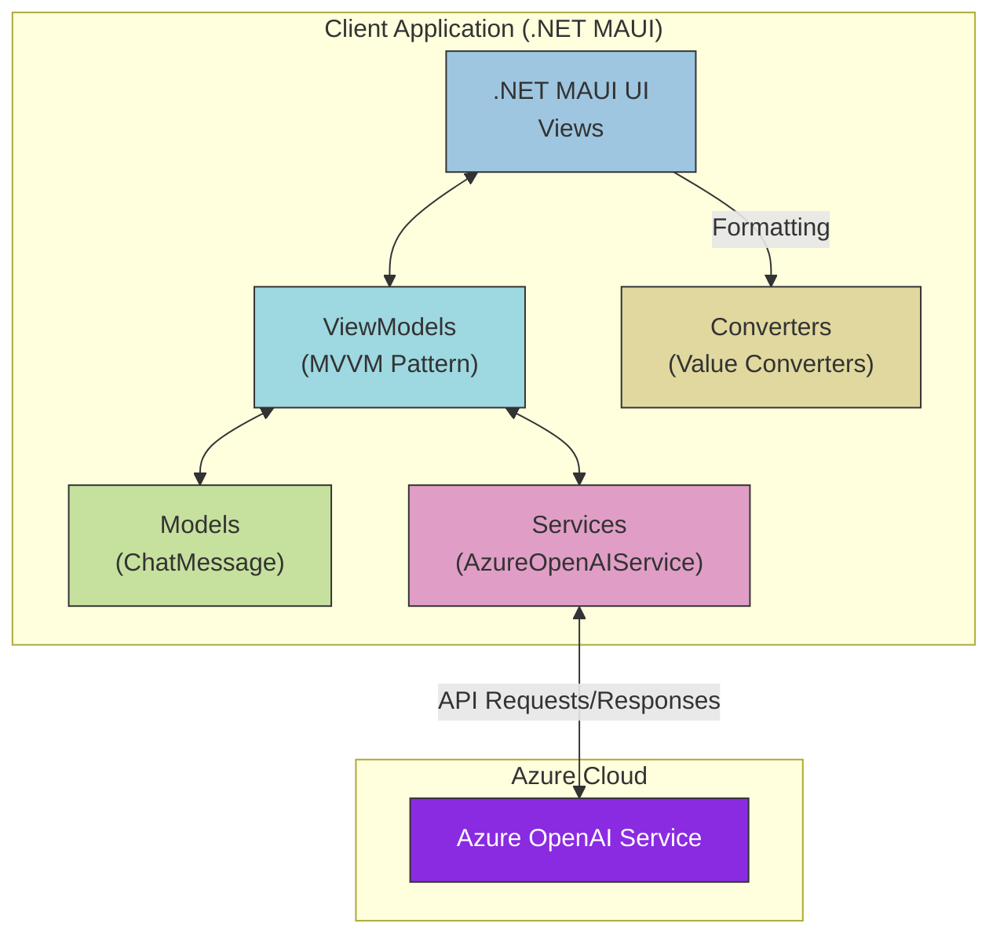

# .NET MAUI Azure OpenAI Chat Application Lab

## Overview

This lab guides you through creating a chat application using .NET MAUI and Azure OpenAI. The application provides a conversational interface where users can interact with an AI assistant powered by Azure OpenAI.

## Application Architecture



The diagram above illustrates the application architecture and data flow:
- **Views**: XAML UI components that display the chat interface
- **ViewModels**: Implement the MVVM pattern to manage UI logic and state
- **Models**: Define data structures like ChatMessage
- **Services**: Handle communication with Azure OpenAI
- **Converters**: Transform data for UI presentation
- **Azure OpenAI Service**: External cloud service providing AI chat capabilities

## Prerequisites
 * Visual Studio 2022 with .NET MAUI workload installed
 * Azure account with OpenAI service enabled
 * Basic understanding of C# and XAML

## Laboratory Objectives
By the end of this laboratory, you will be able to:
1.	Create a .NET MAUI project structure
2.	Implement the MVVM pattern
3.	Design a responsive chat interface
4.	Integrate with Azure OpenAI services
5.	Implement asynchronous messaging functionality

## Step 1: Creating the Project Structure
1.	Open Visual Studio 2022
2.	Click on "Create a new project"
3.	Search for "MAUI" and select ".NET MAUI App" template
4.	Name the project "MauiDemo" and click "Create"

5.	Verify that the created project targets .NET 9 and includes necessary platforms (Android, iOS, macOS, Windows)

## Step 2: Setting Up the Project Dependencies
1.	In Solution Explorer, right-click on the project and select "Manage NuGet Packages"
2.	Install the following packages in this order:

    a. **Azure.AI.OpenAI** (version 2.2.0-beta.2 or later)
       - Click on the "Browse" tab
       - Search for "Azure.AI.OpenAI"
       - Select the package and click "Install"
       - This package enables communication with Azure OpenAI services
       - Make sure to select version 2.2.0-beta.2 or later as it contains the required ChatCompletionsOptions functionality

    b. **Microsoft.Extensions.Logging.Debug** (latest version compatible with .NET 9)
       - This package is required for debug logging functionality
       - Usually installed by default with the .NET MAUI template

3. If you encounter any package dependency resolution issues:
   - Check that your project targets .NET 9
   - Try closing and reopening Visual Studio
   - Clear the NuGet cache (Tools > NuGet Package Manager > Package Manager Settings > Clear All NuGet Cache(s))
   - Restart Visual Studio and try installing the packages again

    

## Step 3: Creating the Models
1.	Create a new folder in the project called "*Models*"
2.	Create a new class file called "ChatMessage.cs" with the following code:

```csharp
namespace MauiDemo.Models
{
    public enum MessageType
    {
        User,
        Bot
    }

    public class ChatMessage
    {
        public string Text { get; }
        public MessageType Type { get; }
        public DateTime Timestamp { get; }

        public ChatMessage(string text, MessageType type)
        {
            Text = text;
            Type = type;
            Timestamp = DateTime.Now;
        }
    }
}
```
 

This class represents messages in our chat application, distinguishing between user messages and bot responses.

## Step 4: Creating the Value Converters
1.	Create a new folder called "Converters"
2.	Create a new class file called "MessageTypeToColorConverter.cs"  to handle the chat UI formatting:

```csharp
using MauiDemo.Models;
using System.Globalization;
namespace MauiDemo.Converters
{
    public class MessageTypeToColorConverter : IValueConverter
    {
        public object? Convert(object? value, Type targetType, object? parameter, CultureInfo culture)
        {
            if (value is MessageType messageType)
            {
                return messageType switch
                {
                    MessageType.User => Color.FromArgb("#DCF8C6"),
                    MessageType.Bot => Colors.LightBlue,
                    _ => Colors.Gray
                };
            }
            return Colors.Gray;
        }

        public object ConvertBack(object? value, Type targetType, object? parameter, CultureInfo culture)
        {
            throw new NotImplementedException();
        }
    }
}
```
 
MessageTypeToAlignmentConverter.cs:
```csharp
using MauiDemo.Models;
using System.Globalization;
namespace MauiDemo.Converters
{
    public class MessageTypeToAlignmentConverter : IValueConverter
    {
        public object? Convert(object? value, Type targetType, object? parameter, CultureInfo culture)
        {
            if (value is MessageType messageType)
            {
                return messageType switch
                {
                    MessageType.User => LayoutOptions.End,
                    MessageType.Bot => LayoutOptions.Start,
                    _ => LayoutOptions.Center
                };
            }
            return LayoutOptions.Center;
        }

        public object? ConvertBack(object? value, Type targetType, object? parameter, CultureInfo culture)
        {
            throw new NotImplementedException();
        }
    }
}
```

MessageTypeToMarginConverter.cs:
```csharp
using MauiDemo.Models;
using System.Globalization;
namespace MauiDemo.Converters
{
    public class MessageTypeToMarginConverter : IValueConverter
    {
        public object Convert(object? value, Type targetType, object? parameter, CultureInfo culture)
        {
            if (value is MessageType messageType)
            {
                return messageType switch
                {
                    MessageType.User => new Thickness(80, 5, 10, 5),
                    MessageType.Bot => new Thickness(10, 5, 80, 5),
                    _ => new Thickness(10, 5)
                };
            }
            return new Thickness(10, 5);
        }

        public object? ConvertBack(object? value, Type targetType, object? parameter, CultureInfo culture)
        {
            throw new NotImplementedException();
        }
    }
}
```

  

These converters will be used to format the chat messages based on their type (user or bot).

## Step 5: Creating the Azure OpenAI Service
1.	Create a "Services" folder in the project
2.	Add a new class called "AzureOpenAIService.cs" with the following code:

```csharp
using Azure;
using Azure.AI.OpenAI;
using OpenAI;
using OpenAI.Chat;
using System.ClientModel;

namespace MauiDemo.Services;

public class AzureOpenAIService
{
    private readonly string _endpoint;
    private readonly string _key;
    private readonly string _deploymentName;
    private readonly AzureOpenAIClient _client;
    private readonly ChatClient _chatClient;

    public AzureOpenAIService(string endpoint, string key, string deploymentName)
    {
        _endpoint = endpoint;
        _key = key;
        _deploymentName = deploymentName;

        _client = new(
            new Uri(_endpoint),
            new ApiKeyCredential(_key));

        _chatClient = _client.GetChatClient(_deploymentName);
    }

    public async Task<string> GetCompletionAsync(List<ChatMessage> messages)
    {
        try
        {
            ChatCompletion completion = await _chatClient.CompleteChatAsync(messages);
            return completion.Content[0].Text;
        }
        catch (Exception ex)
        {
            return $"Error: {ex.Message}";
        }
    }
}

```
   

This class encapsulates the logic for interacting with the Azure OpenAI service to get chat completions based on the provided messages.

## Step 6: Creating the ViewModel

1.	Create a "ViewModels" folder in the project
2.	Add the ChatBotViewModel.cs file as shown in your code:

```csharp
using MauiDemo.Models;
using MauiDemo.Services;
using OpenAI.Chat;
using System.Collections.ObjectModel;
using System.ComponentModel;
using System.Runtime.CompilerServices;
using System.Windows.Input;
using ChatMessage = MauiDemo.Models.ChatMessage;

namespace MauiDemo.ViewModels
{
    public class ChatBotViewModel : INotifyPropertyChanged
    {
        private readonly AzureOpenAIService _openAIService;
        private readonly List<OpenAI.Chat.ChatMessage> _messages;
        private string _userInput;
        private bool _isBotTyping;
        private ChatMessage _lastMessage;

        public ObservableCollection<ChatMessage> Messages { get; }
        public ICommand SendMessageCommand { get; }

        public string UserInput
        {
            get => _userInput;
            set
            {
                if (_userInput != value)
                {
                    _userInput = value;
                    OnPropertyChanged();
                }
            }
        }

        public bool IsBotTyping
        {
            get => _isBotTyping;
            set
            {
                if (_isBotTyping != value)
                {
                    _isBotTyping = value;
                    OnPropertyChanged();
                }
            }
        }

        public ChatMessage LastMessage
        {
            get => _lastMessage;
            set
            {
                if (_lastMessage != value)
                {
                    _lastMessage = value;
                    OnPropertyChanged();
                }
            }
        }

        public ChatBotViewModel(AzureOpenAIService openAIService)
        {
            _openAIService = openAIService;
            Messages = new ObservableCollection<ChatMessage>();
            SendMessageCommand = new Command(async () => await SendMessage());

            _messages = new List<OpenAI.Chat.ChatMessage>
            {
                new SystemChatMessage("You are a helpful assistant.")
            };
        }

        private async Task SendMessage()
        {
            if (string.IsNullOrWhiteSpace(UserInput))
                return;

            var userMessageText = UserInput.Trim();

            // Add user message to UI collection
            var userMessage = new ChatMessage(userMessageText, MessageType.User);
            Messages.Add(userMessage);
            LastMessage = userMessage;

            // Add message to OpenAI context
            _messages.Add(new UserChatMessage(userMessageText));

            // Clear input
            UserInput = string.Empty;

            // Show typing indicator
            IsBotTyping = true;

            // Get response
            string response = await _openAIService.GetCompletionAsync(_messages);

            // Hide typing indicator
            IsBotTyping = false;

            // Add bot response to UI collection
            var botMessage = new ChatMessage(response, MessageType.Bot);
            Messages.Add(botMessage);
            LastMessage = botMessage;

            // Add bot response to OpenAI context
            _messages.Add(new AssistantChatMessage(response));
        }

        public event PropertyChangedEventHandler PropertyChanged;

        protected virtual void OnPropertyChanged([CallerMemberName] string propertyName = null)
        {
            PropertyChanged?.Invoke(this, new PropertyChangedEventArgs(propertyName));
        }
    }
}
```
    

This class represents the ViewModel for the chat application, handling user input, message processing, and interaction with the Azure OpenAI service.

## Step 7: Creating the Chat Interface
1.	Create a "Views" folder in the project if it doesn't exist
2.	Right-click on the Views folder, select Add > New Item
3.	Under .NET MAUI choose ".NET MAUI Content Page (XAML)" and name it "ChatBotView.xaml"
4.	Replace the content with the following XAML:

```xml
<?xml version="1.0" encoding="utf-8" ?>
<ContentPage xmlns="http://schemas.microsoft.com/dotnet/2021/maui"
             xmlns:x="http://schemas.microsoft.com/winfx/2009/xaml"
             xmlns:models="clr-namespace:MauiDemo.Models"
             xmlns:viewmodels="clr-namespace:MauiDemo.ViewModels"
             x:Class="MauiDemo.Views.ChatBotView"             
             x:DataType="viewmodels:ChatBotViewModel">

    <Shell.TitleView>
        <Grid HorizontalOptions="Fill">
            <Label Text="CENACE ChatBot" 
                   HorizontalOptions="Center" 
                   VerticalOptions="Center" 
                   FontAttributes="Bold" 
                   TextColor="Gray"
                   FontSize="20"/>
        </Grid>
    </Shell.TitleView>

    <Grid Padding="10">
        <Grid.RowDefinitions>
            <RowDefinition Height="*" />
            <RowDefinition Height="Auto" />
        </Grid.RowDefinitions>

        <!-- Scrollable area containing the conversation -->
        <CollectionView x:Name="MessageList"
                        Grid.Row="0" 
                        ItemsSource="{Binding Messages}"
                        Margin="0,0,0,10">
            <CollectionView.ItemTemplate>
                <DataTemplate x:DataType="models:ChatMessage">
                    <Grid Padding="5">
                        <Border BackgroundColor="{Binding Type, Converter={StaticResource MessageTypeToColorConverter}}"
                                Stroke="{Binding Type, Converter={StaticResource MessageTypeToColorConverter}}"
                                StrokeShape="RoundRectangle 12"
                                StrokeThickness="1"
                                Padding="10"
                                HorizontalOptions="{Binding Type, Converter={StaticResource MessageTypeToAlignmentConverter}}"
                                Margin="{Binding Type, Converter={StaticResource MessageTypeToMarginConverter}}">
                            <Label Text="{Binding Text}"
                                   TextColor="Black"
                                   LineBreakMode="WordWrap" />
                        </Border>
                    </Grid>
                </DataTemplate>
            </CollectionView.ItemTemplate>
            <CollectionView.Footer>
                <Grid IsVisible="{Binding IsBotTyping}">
                    <Label Text="Bot is typing..." 
                           TextColor="Gray" 
                           Margin="15,0,0,5"
                           HorizontalOptions="Start" />
                </Grid>
            </CollectionView.Footer>
        </CollectionView>

        <Grid Padding="10" Grid.Row="1" >
            <Border BackgroundColor="#F0F0F0" StrokeShape="RoundRectangle 10" Padding="10,10,0,10" HorizontalOptions="Fill">
                <Grid>
                    <Entry Text="{Binding UserInput}"
                           Placeholder="Message" 
                           TextColor="Black"
                           FontSize="16" 
                           VerticalOptions="Center" 
                           Margin="0,0,50,0"
                           ReturnCommand="{Binding SendMessageCommand}"/>

                    <Button Command="{Binding SendMessageCommand}"
                            BackgroundColor="Transparent" 
                            TextColor="Black"
                            WidthRequest="60" 
                            ImageSource="send.png"
                            HeightRequest="20" 
                            HorizontalOptions="End" 
                            Margin="0"
                            VerticalOptions="Center" />
                </Grid>
            </Border>
        </Grid>
    </Grid>
</ContentPage>

```
This XAML defines the chat interface layout, including the conversation area, message formatting, and user input controls.


5.	Create the associated code-behind file "ChatBotView.xaml.cs" with the following content:

```csharp
using MauiDemo.Models;
using MauiDemo.Services;
using MauiDemo.ViewModels;

namespace MauiDemo.Views;

public partial class ChatBotView : ContentPage
{
    private ChatBotViewModel _viewModel;

    public ChatBotView(AzureOpenAIService openAIService)
    {
        InitializeComponent();
        _viewModel = new ChatBotViewModel(openAIService);
        BindingContext = _viewModel;

        // Subscribe to property changes for LastMessage
        _viewModel.PropertyChanged += ViewModel_PropertyChanged;
    }

    private void ViewModel_PropertyChanged(object sender, System.ComponentModel.PropertyChangedEventArgs e)
    {
        if (e.PropertyName == nameof(ChatBotViewModel.LastMessage) && _viewModel.LastMessage != null)
        {
            // Scroll to the last message
            ScrollToLastMessage();
        }
    }

    private void ScrollToLastMessage()
    {
        if (_viewModel.Messages.Count > 0)
        {
            MessageList.ScrollTo(_viewModel.Messages.Count - 1, position: ScrollToPosition.End, animate: true);
        }
    }

    protected override void OnAppearing()
    {
        base.OnAppearing();
        // Ensure we scroll to the last message when the page appears
        ScrollToLastMessage();
    }
}

```
    

This code-behind file sets the ViewModel as the binding context for the view and ensures that the entry field gets focus when the page appears.

## Step 8: Registering Resources and Services
1.	Open App.xaml and add the following Resource Dictionary:

```xml
<?xml version = "1.0" encoding = "UTF-8" ?>
<Application xmlns="http://schemas.microsoft.com/dotnet/2021/maui"
             xmlns:x="http://schemas.microsoft.com/winfx/2009/xaml"
             xmlns:local="clr-namespace:MauiDemo"
             xmlns:converters="clr-namespace:MauiDemo.Converters"
             x:Class="MauiDemo.App">
    <Application.Resources>
        <ResourceDictionary>
            <ResourceDictionary.MergedDictionaries>
                <ResourceDictionary Source="Resources/Styles/Colors.xaml" />
                <ResourceDictionary Source="Resources/Styles/Styles.xaml" />
            </ResourceDictionary.MergedDictionaries>

            <converters:MessageTypeToColorConverter x:Key="MessageTypeToColorConverter" />
            <converters:MessageTypeToAlignmentConverter x:Key="MessageTypeToAlignmentConverter" />
            <converters:MessageTypeToMarginConverter x:Key="MessageTypeToMarginConverter" />

        </ResourceDictionary>

    </Application.Resources>
</Application>

```
2.	Open MauiProgram.cs to register services and view models:
```csharp
using Microsoft.Extensions.Logging;
using MauiDemo.Services;
using MauiDemo.Views;

namespace MauiDemo;

public static class MauiProgram
{
    public static MauiApp CreateMauiApp()
    {
        var builder = MauiApp.CreateBuilder();
        builder
            .UseMauiApp<App>()
            .ConfigureFonts(fonts =>
            {
                fonts.AddFont("OpenSans-Regular.ttf", "OpenSansRegular");
                fonts.AddFont("OpenSans-Semibold.ttf", "OpenSansSemibold");
            });

        // Register Azure OpenAI service
        builder.Services.AddSingleton(new AzureOpenAIService(
            endpoint: "YOUR_AZURE_OPENAI_ENDPOINT", 
            key: "YOUR_AZURE_OPENAI_KEY",
            deploymentName: "YOUR_DEPLOYMENT_NAME"
        ));

        // Register views
        builder.Services.AddTransient<ChatBotView>();

#if DEBUG
        builder.Logging.AddDebug();
#endif

        return builder.Build();
    }
}

```
This code registers the Azure OpenAI service, view models, and views with the application. 
Taking a deep breath and focusing on completing the lab guide with the remaining steps...
Images/register-services.png


## Step 09: Update AppShell.xaml to Include ChatBotView
Open AppShell.xaml and modify it to register and navigate to ChatBotView:
```xml
<?xml version="1.0" encoding="UTF-8" ?>
<Shell
    x:Class="MauiDemo.AppShell"
    xmlns="http://schemas.microsoft.com/dotnet/2021/maui"
    xmlns:x="http://schemas.microsoft.com/winfx/2009/xaml"
    xmlns:local="clr-namespace:MauiDemo.Views"
    Shell.FlyoutBehavior="Flyout">

    <ShellContent
        Title="Home"
        ContentTemplate="{DataTemplate local:ChatBotView}"
        Route="ChatBotView" />

</Shell>
```

## Step 10: Add a Send Icon to Resources

   1. Add icons named "send.svg" [Download](https://github.com/ramonsolorio/MauiDemo/blob/master/Resources/Images/send.svg)
   2. "history.svg" [Download](https://github.com/ramonsolorio/MauiDemo/blob/master/Resources/Images/history.svg) 
   2. "plus.svg" [Download](https://github.com/ramonsolorio/MauiDemo/blob/master/Resources/Images/plus.svg) 
   3. "stats.svg" [Download](https://github.com/ramonsolorio/MauiDemo/blob/master/Resources/Images/stats.svg) to the Resources/Images folder 
   4. Make sure to set the Build Action to "MauiImage" in the file properties
   5. Update the Button in ChatBotView.xaml to use the correct image:

```xml
<Button Command="{Binding SendMessageCommand}"
        BackgroundColor="Transparent" 
        WidthRequest="40" 
        ImageSource="send.png" 
        HeightRequest="40" 
        HorizontalOptions="End" 
        VerticalOptions="Center" />
```

## Step 11: Configure Azure OpenAI Service
1.	Log in to the Azure portal (https://portal.azure.com/)
2.	Create or access your Azure OpenAI resource
3.	Obtain the following information:
�	Endpoint URL
�	API Key
�	Deployment name for your model
Images/azure-openai-settings.png
4.	Update MauiProgram.cs with your actual Azure OpenAI credentials:

```csharp
builder.Services.AddSingleton<AzureOpenAIService>(serviceProvider => 
    new AzureOpenAIService(
        "https://your-resource-name.openai.azure.com/", 
        "your-api-key",
        "your-deployment-name"));
```

## Step 12: Build and Run the Application
1.	Select your target platform (Windows, Android, iOS, or MacOS)
2.	Click the "Run" button in Visual Studio 2022 or press F5
Images/select-platform.png
3.	Wait for the application to build and deploy

## Step 13: Test the ChatBot Application
1.	When the application launches, you'll see the chat interface
2.	Enter a message in the text field at the bottom
3.	Press the send button or hit Enter
4.	Your message will appear on the right side of the screen
5.	The "Bot is typing..." indicator will appear briefly
6.	The bot's response will appear on the left side

    

## Step 14: Debug and Troubleshoot
If you encounter any issues:
1.	Check the Debug output in Visual Studio for error messages
2.	Verify your Azure OpenAI service is properly configured
3.	Ensure all NuGet packages are correctly installed


## Step 15: Using Configuration Files for Better Settings Management
In this step, we'll improve the application by moving the Azure OpenAI credentials from hardcoded values to an external configuration file. This is a best practice for several reasons:

Better security: Keeps sensitive information out of source code
Easier configuration management: Update settings without changing code
Environment-specific configuration: Different settings for development and production
Better separation of concerns: Application logic stays separate from configuration
Implementing Configuration Files in .NET MAUI
1. Add the required NuGet package:

    * Right-click on the project in Solution Explorer and select "Manage NuGet Packages"
    * Search for and install Microsoft.Extensions.Configuration.Json package
    * Or execute this command directly in your console:
        ```
        dotnet add package Microsoft.Extensions.Configuration.Json
        ```
2. Create the appsettings.json file:

    Right-click on your project, select Add > New Item
    Create a new JSON file named appsettings.json
    Add the following content:
    ```json
    {
        "AzureOpenAI": 
        {
            "Endpoint": "YOUR_AZURE_OPENAI_ENDPOINT",
            "ApiKey": "YOUR_AZURE_OPENAI_KEY",
            "DeploymentName": "YOUR_DEPLOYMENT_NAME"
        }
    }
    ```
3. Configure the appsettings.json file in the project:
    * Select the appsettings.json file in Solution Explorer
    * In the Properties window, set:
        * Build Action: EmbeddedResource
        * Copy to Output Directory: Always
    * Or add these settings to your .csproj file:
        ```xml
        <ItemGroup>
        <None Remove="appsettings.json" />
        </ItemGroup>
        <ItemGroup>
        <EmbeddedResource Include="appsettings.json">
            <CopyToOutputDirectory>Always</CopyToOutputDirectory>
        </EmbeddedResource>
        </ItemGroup>
        ```
4. Update MauiProgram.cs to read from the configuration file:
    * Add necessary using directives
    * Load the configuration from the embedded resource
    * Extract the Azure OpenAI settings
        ```csharp
        //Update references
        using Microsoft.Extensions.Configuration;
        using System.Reflection;

        // Inside CreateMauiApp method:
        using var stream = Assembly.GetExecutingAssembly().GetManifestResourceStream("MauiDemo.appsettings.json");
        if (stream == null)
        {
            throw new InvalidOperationException("Failed to load the embedded resource 'MauiDemo.appsettings.json'.");
        }
        var config = new ConfigurationBuilder().AddJsonStream(stream).Build();
        var endpoint = config["AzureOpenAI:Endpoint"] ?? throw new InvalidOperationException("AzureOpenAI:Endpoint is not configured.");
        var apiKey = config["AzureOpenAI:ApiKey"] ?? throw new InvalidOperationException("AzureOpenAI:ApiKey is not configured.");
        var deploymentName = config["AzureOpenAI:DeploymentName"] ?? throw new InvalidOperationException("AzureOpenAI:DeploymentName is not configured.");

        builder.Services.AddSingleton(new AzureOpenAIService(endpoint, apiKey, deploymentName));
        ```
5. Update your local settings:

    * Open the appsettings.json file
    * Replace the placeholder values with your actual Azure OpenAI credentials
    * Important: Add appsettings.json with real credentials to your .gitignore file to prevent committing sensitive information

* Benefits of This Approach
    * Security: Your API keys and other sensitive information are not hardcoded in source code
    * Configurability: You can change settings without recompiling the application
    * Maintainability: Centralizes all configuration in one place
    * Environment support: Makes it easier to use different settings in development and production

## Step 16: Adding a Statistics View
In this step, you'll add a screen to show usage statistics about your chat interactions.

1. Create a ViewModel ChatStatsViewModel.cs for the statistics view in the ViewModels folder:

```csharp
using System.ComponentModel;
using System.Runtime.CompilerServices;
using MauiDemo.Models;

namespace MauiDemo.ViewModels
{
    public class ChatStatsViewModel : INotifyPropertyChanged
    {
        private readonly ChatBotViewModel _chatBotViewModel;
        private int _userMessageCount;
        private int _botMessageCount;
        private int _totalMessageCount;

        public int UserMessageCount
        {
            get => _userMessageCount;
            set
            {
                if (_userMessageCount != value)
                {
                    _userMessageCount = value;
                    OnPropertyChanged();
                }
            }
        }

        public int BotMessageCount
        {
            get => _botMessageCount;
            set
            {
                if (_botMessageCount != value)
                {
                    _botMessageCount = value;
                    OnPropertyChanged();
                }
            }
        }

        public int TotalMessageCount
        {
            get => _totalMessageCount;
            set
            {
                if (_totalMessageCount != value)
                {
                    _totalMessageCount = value;
                    OnPropertyChanged();
                }
            }
        }

        public ChatStatsViewModel(ChatBotViewModel chatBotViewModel)
        {
            _chatBotViewModel = chatBotViewModel;
            UpdateStats();
            
            // Subscribe to changes in the messages to update statistics
            _chatBotViewModel.PropertyChanged += ChatBotViewModel_PropertyChanged;
        }

        private void ChatBotViewModel_PropertyChanged(object sender, PropertyChangedEventArgs e)
        {
            if (e.PropertyName == nameof(ChatBotViewModel.LastMessage))
            {
                UpdateStats();
            }
        }

        private void UpdateStats()
        {
            UserMessageCount = _chatBotViewModel.Messages.Count(m => m.Type == MessageType.User);
            BotMessageCount = _chatBotViewModel.Messages.Count(m => m.Type == MessageType.Bot);
            TotalMessageCount = _chatBotViewModel.Messages.Count;
        }

        public event PropertyChangedEventHandler PropertyChanged;

        protected virtual void OnPropertyChanged([CallerMemberName] string propertyName = null)
        {
            PropertyChanged?.Invoke(this, new PropertyChangedEventArgs(propertyName));
        }
    }
}
```

2. Create a new view called `ChatStatsView.xaml` in the Views folder:

```xml
<?xml version="1.0" encoding="utf-8"?>
<ContentPage xmlns="http://schemas.microsoft.com/dotnet/2021/maui"
             xmlns:x="http://schemas.microsoft.com/winfx/2009/xaml"
             xmlns:viewmodels="clr-namespace:MauiDemo.ViewModels"
             x:Class="MauiDemo.Views.ChatStatsView"
             x:DataType="viewmodels:ChatStatsViewModel">

    <ScrollView>
        <Grid Padding="20">
            <Border BackgroundColor="#ffffff" 
                    Padding="20" 
                    StrokeShape="RoundRectangle 15"
                    Stroke="#d1d1d1"
                    VerticalOptions="Start">
                <VerticalStackLayout Spacing="20">
                    <Label Text="Interaction Statistics"
                           FontSize="28"
                           FontAttributes="Bold"
                           TextColor="#333"
                           HorizontalOptions="Center" />

                    <Grid ColumnDefinitions="40, *, Auto" RowDefinitions="Auto, Auto, Auto, Auto" ColumnSpacing="10" RowSpacing="15">
                        <!-- Headers -->
                        <Label Text="Metric" 
                               Grid.Row="0" Grid.Column="1" 
                               FontAttributes="Bold"
                               FontSize="18"
                               TextColor="#555"
                               HorizontalOptions="Start" />
                        <Label Text="Count" 
                               Grid.Row="0" Grid.Column="2" 
                               FontAttributes="Bold"
                               FontSize="18"
                               TextColor="#555"
                               HorizontalOptions="End" />

                        <!-- User Messages -->
                        <Image Source="user_icon.png" 
                               Grid.Row="1" Grid.Column="0" 
                               HeightRequest="24" WidthRequest="24" 
                               VerticalOptions="Center" />
                        <Label Text="User Messages" 
                               Grid.Row="1" Grid.Column="1" 
                               FontSize="16"
                               TextColor="#333"
                               VerticalOptions="Center" />
                        <Label Text="{Binding UserMessageCount}" 
                               Grid.Row="1" Grid.Column="2"
                               FontSize="20"
                               FontAttributes="Bold"
                               TextColor="#0078D7"
                               HorizontalOptions="End"
                               VerticalOptions="Center" />

                        <!-- Bot Messages -->
                        <Image Source="bot_icon.png" 
                               Grid.Row="2" Grid.Column="0" 
                               HeightRequest="24" WidthRequest="24" 
                               VerticalOptions="Center" />
                        <Label Text="Bot Responses" 
                               Grid.Row="2" Grid.Column="1" 
                               FontSize="16"
                               TextColor="#333"
                               VerticalOptions="Center" />
                        <Label Text="{Binding BotMessageCount}" 
                               Grid.Row="2" Grid.Column="2" 
                               FontSize="20"
                               FontAttributes="Bold"
                               TextColor="#0078D7"
                               HorizontalOptions="End"
                               VerticalOptions="Center" />

                        <!-- Total -->
                        <Image Source="total_icon.png" 
                               Grid.Row="3" Grid.Column="0" 
                               HeightRequest="24" WidthRequest="24" 
                               VerticalOptions="Center" />
                        <Label Text="Total Interactions" 
                               Grid.Row="3" Grid.Column="1" 
                               FontSize="16"
                               FontAttributes="Bold"
                               TextColor="#333"
                               VerticalOptions="Center" />
                        <Label Text="{Binding TotalMessageCount}" 
                               Grid.Row="3" Grid.Column="2" 
                               FontSize="20"
                               FontAttributes="Bold"
                               TextColor="#0078D7"
                               HorizontalOptions="End"
                               VerticalOptions="Center" />
                    </Grid>
                </VerticalStackLayout>
            </Border>
        </Grid>
    </ScrollView>
</ContentPage>

```
Add icons for user, bot, and total interactions to the Resources/Images folder. You can use any icons you prefer, or create simple placeholders for now. Name them `user_icon.png`, `bot_icon.png`, and `total_icon.png` respectively.

3. Create the code-behind file `ChatStatsView.xaml.cs`:

```csharp
using MauiDemo.ViewModels;

namespace MauiDemo.Views;

public partial class ChatStatsView : ContentPage
{
    private ChatStatsViewModel _viewModel;

    public ChatStatsView(ChatBotViewModel chatBotViewModel)
    {
        InitializeComponent();
        _viewModel = new ChatStatsViewModel(chatBotViewModel);
        BindingContext = _viewModel;
    }
}
```

4. Update the AppShell.xaml to include the statistics view in the flyout menu:

```xml
<?xml version="1.0" encoding="UTF-8" ?>
<Shell
    x:Class="MauiDemo.AppShell"
    xmlns="http://schemas.microsoft.com/dotnet/2021/maui"
    xmlns:x="http://schemas.microsoft.com/winfx/2009/xaml"
    xmlns:local="clr-namespace:MauiDemo.Views"
    Shell.FlyoutBehavior="Flyout"
    Title="MauiDemo">


    <Shell.FlyoutHeader>
        <Grid HeightRequest="100" BackgroundColor="#f0f0f0">
            <Label Text="CENACE" 
                  FontSize="16" 
                  TextColor="Black"
                  FontAttributes="Bold" 
                  HorizontalOptions="Center" 
                  VerticalOptions="Center"/>
        </Grid>
    </Shell.FlyoutHeader>

    <FlyoutItem Title="Chat" Icon="send.png">
        <ShellContent
            ContentTemplate="{DataTemplate local:ChatBotView}"
            Route="ChatBotView" />
    </FlyoutItem>

    <FlyoutItem Title="Statistics" Icon="stats.png">
        <ShellContent
            ContentTemplate="{DataTemplate local:ChatStatsView}"
            Route="ChatStats" />
    </FlyoutItem>

</Shell>

```

5. Update MauiProgram.cs to register the new view and ensure ChatBotViewModel is shared:

```csharp

// Register ChatBotViewModel as singleton to share between views
builder.Services.AddSingleton<ChatBotViewModel>();

// Register views
builder.Services.AddTransient<ChatBotView>();
builder.Services.AddTransient<ChatStatsView>();
```


6. Update the constructor of ChatBotView.cs to accept the shared ChatBotViewModel:

```csharp
public ChatBotView(AzureOpenAIService openAIService, ChatBotViewModel viewModel = null)
{
    InitializeComponent();
    _viewModel = viewModel ?? new ChatBotViewModel(openAIService);
    BindingContext = _viewModel;

    // Subscribe to property changes for LastMessage
    _viewModel.PropertyChanged += ViewModel_PropertyChanged;
}
```


Now your application has a statistics screen accessible from the flyout menu that shows counts of user messages, bot responses, and total interactions. The statistics will update automatically when new messages are added to the conversation.

## Step 17: Implementing Message Persistence with Local Database

In this step, we'll enhance the chat application by implementing local database storage for chat messages. This will allow conversations to persist between application sessions.

### Adding the Required NuGet Packages
First, add the SQLite packages to your project:

1. Right-click on the project and select "Manage NuGet Packages"
2. Search for and install the following packages:
    * sqlite-net-pcl
    * SQLitePCLRaw.core
    * SQLitePCLRaw.bundle_green

### Updating the Database Model

1. Add a new class called ChatConversation.cs into Models folder:
    ```csharp
        using SQLite;
        using System.Collections.Generic;

        namespace MauiDemo.Models
        {
            public class ChatConversation
            {
                [PrimaryKey, AutoIncrement]
                public int Id { get; set; }
                
                public string Title { get; set; }
                
                public DateTime CreatedAt { get; set; }
                
                public DateTime LastUpdatedAt { get; set; }
                
                [Ignore]
                public List<ChatMessage> Messages { get; set; } = new List<ChatMessage>();
                
                public ChatConversation()
                {
                    CreatedAt = DateTime.Now;
                    LastUpdatedAt = DateTime.Now;
                    Title = $"Conversation {CreatedAt.ToString("yyyy-MM-dd HH:mm")}";
                }
                
                public ChatConversation(string title)
                {
                    Title = title;
                    CreatedAt = DateTime.Now;
                    LastUpdatedAt = DateTime.Now;
                }
            }
        }
    ```
2. Update existing model Models/ChatMessage.cs  
   This model represents a chat message in the conversation. It includes properties for the message text, type (user or bot), timestamp, and order in the conversation.
    ```csharp
        namespace MauiDemo.Models
        {
            public enum MessageType
            {
                User,
                Bot
            }

            public class ChatMessage
            {
                [SQLite.PrimaryKey, SQLite.AutoIncrement, SQLite.Column("id")]
                public int Id { get; set; }
                
                [SQLite.Column("conversation_id")]
                public int ConversationId { get; set; }
                
                [SQLite.Column("message_text")]
                public string Text { get; set; }
                
                [SQLite.Column("message_type")]
                public MessageType Type { get; set; }
                
                [SQLite.Column("timestamp")]
                public DateTime Timestamp { get; set; }
                
                [SQLite.Column("order_field")]
                public int Order { get; set; }

                public ChatMessage(string text, MessageType type)
                {
                    Text = text;
                    Type = type;
                    Timestamp = DateTime.Now;
                }
                
                // Parameterless constructor for SQLite
                public ChatMessage() 
                {
                    Timestamp = DateTime.Now;
                }
            }
        }
    ```
3. Add new service called Services/DatabaseService.cs

    ```csharp 
    using SQLite;
    using MauiDemo.Models;
    using System.Collections.Generic;
    using System.Linq;
    using System.Threading;

    namespace MauiDemo.Services
    {
        public class DatabaseService
        {
            private readonly SQLiteAsyncConnection _database; // Make field readonly
            private bool _initialized = false;
            private readonly SemaphoreSlim _initializationSemaphore = new SemaphoreSlim(1, 1);

            public DatabaseService(string dbPath)
            {
                _database = new SQLiteAsyncConnection(dbPath);
                //Initialize the database
                InitializeAsync().ConfigureAwait(false);
            }

            public async Task InitializeAsync()
            {
                // Only allow one thread to initialize the database
                await _initializationSemaphore.WaitAsync();

                try
                {
                    if (!_initialized)
                    {
                        await _database.CreateTableAsync<ChatConversation>();
                        await _database.CreateTableAsync<ChatMessage>();
                        _initialized = true;
                    }
                }
                finally
                {
                    _initializationSemaphore.Release();
                }
            }


            // Conversation methods
            public async Task<List<ChatConversation>> GetAllConversationsAsync()
            {
                
                return await _database.Table<ChatConversation>().OrderByDescending(c => c.LastUpdatedAt).ToListAsync();
            }

            public async Task<ChatConversation> GetConversationAsync(int id)
            {
                
                var conversation = await _database.Table<ChatConversation>().Where(c => c.Id == id).FirstOrDefaultAsync();
                if (conversation != null)
                {
                    conversation.Messages = await GetConversationMessagesAsync(id);
                }
                return conversation;
            }

            public async Task<int> SaveConversationAsync(ChatConversation conversation)
            {
                
                if (conversation.Id != 0)
                {
                    conversation.LastUpdatedAt = DateTime.Now;
                    await _database.UpdateAsync(conversation);
                    return conversation.Id;
                }
                else
                {
                    // Insert the conversation
                    await _database.InsertAsync(conversation);
                    // Return the auto-incremented ID that was assigned
                    return conversation.Id;
                }
            }

            public async Task<int> DeleteConversationAsync(ChatConversation conversation)
            {
                
                // First delete all messages in the conversation
                await _database.Table<ChatMessage>()
                    .Where(m => m.ConversationId == conversation.Id)
                    .DeleteAsync();

                // Then delete the conversation
                return await _database.DeleteAsync(conversation);
            }

            // Message methods
            public async Task<List<ChatMessage>> GetConversationMessagesAsync(int conversationId)
            {
                
                return await _database.Table<ChatMessage>()
                    .Where(m => m.ConversationId == conversationId)
                    .OrderBy(m => m.Order)
                    .ToListAsync();
            }

            public async Task<int> SaveMessageAsync(ChatMessage message, int conversationId)
            {
                
                message.ConversationId = conversationId;

                if (message.Id != 0)
                {
                    return await _database.UpdateAsync(message);
                }
                else
                {
                    return await _database.InsertAsync(message);
                }
            }

            public async Task SaveMessagesAsync(List<ChatMessage> messages, int conversationId)
            {
                
                for (int i = 0; i < messages.Count; i++)
                {
                    messages[i].ConversationId = conversationId;
                    messages[i].Order = i;                
                    await SaveMessageAsync(messages[i], conversationId);
                }
            }
        }
    }
    ```

4. Add BaseViewModel.cs to the ViewModels folder. 

    This will be the base class for all view models in the application. It implements INotifyPropertyChanged to support data binding. 

    ```csharp
    using System.ComponentModel;
    using System.Runtime.CompilerServices;

    namespace MauiDemo.ViewModels
    {
        public class BaseViewModel : INotifyPropertyChanged
        {
            public event PropertyChangedEventHandler? PropertyChanged;
            protected void OnPropertyChanged([CallerMemberName] string propertyName = null)
            {
                PropertyChanged?.Invoke(this, new PropertyChangedEventArgs(propertyName));
            }

            protected bool SetProperty<T>(ref T backingStore, T value, [CallerMemberName] string propertyName = "")
            {
                if (EqualityComparer<T>.Default.Equals(backingStore, value))
                    return false;

                backingStore = value;
                OnPropertyChanged(propertyName);
                return true;
            }
        }
    }
    ```

5. Add ChatHistoryViewModel.cs to the ViewModels folder. 
    This will be the view model for the chat history view, which will display a list of conversations. It will also handle loading and deleting conversations.
    ```csharp
    using MauiDemo.Models;
    using MauiDemo.Services;
    using System.Collections.ObjectModel;
    using System.ComponentModel;
    using System.Runtime.CompilerServices;
    using System.Windows.Input;

    namespace MauiDemo.ViewModels
    {
        public class ChatHistoryViewModel : BaseViewModel
        {
            private readonly DatabaseService _databaseService;
            private ChatConversation? _selectedConversation;

            public ObservableCollection<ChatConversation> Conversations { get; }
            public ICommand LoadConversationCommand { get; }
            public ICommand DeleteConversationCommand { get; }
            public ICommand RefreshCommand { get; }

            public ChatConversation SelectedConversation
            {
                get => _selectedConversation!;
                set
                {
                    if (_selectedConversation != value)
                    {
                        _selectedConversation = value;
                        OnPropertyChanged();
                    }
                }
            }

            public ChatHistoryViewModel(DatabaseService databaseService)
            {
                _databaseService = databaseService;
                Conversations = new ObservableCollection<ChatConversation>();

                LoadConversationCommand = new Command<ChatConversation>(async (conversation) =>
                    await Shell.Current.GoToAsync($"//ChatBotView?conversationId={conversation.Id}"));

                DeleteConversationCommand = new Command<ChatConversation>(async (conversation) =>
                    await DeleteConversation(conversation));

                RefreshCommand = new Command(async () => await LoadConversations());

            }

            public async Task LoadConversations()
            {
                Conversations.Clear();
                var conversations = await _databaseService.GetAllConversationsAsync();
                foreach (var conversation in conversations)
                {
                    Conversations.Add(conversation);
                }
            }

            private async Task DeleteConversation(ChatConversation conversation)
            {
                if (conversation != null)
                {
                    await _databaseService.DeleteConversationAsync(conversation);
                    Conversations.Remove(conversation);
                }
            }

        }
    }
    ```
6. Add ChatHistoryView.xaml to the Views folder. 
    This will be the view for displaying the chat history, including a list of conversations and options to delete or load them.
    ```xml
    <?xml version="1.0" encoding="utf-8"?>
    <ContentPage xmlns="http://schemas.microsoft.com/dotnet/2021/maui"
                xmlns:x="http://schemas.microsoft.com/winfx/2009/xaml"
                xmlns:viewmodels="clr-namespace:MauiDemo.ViewModels"
                xmlns:models="clr-namespace:MauiDemo.Models"
                x:Class="MauiDemo.Views.ChatHistoryView"
                x:DataType="viewmodels:ChatHistoryViewModel"
                Title="Conversation History">

        <Grid Padding="20">
            <Grid.RowDefinitions>
                <!--<RowDefinition Height="Auto"/>-->
                <RowDefinition Height="*"/>
            </Grid.RowDefinitions>

            <!--<Label Text="Conversation History" 
                FontSize="24" 
                FontAttributes="Bold" 
                TextColor="#333"
                Margin="0,0,0,10"
                Grid.Row="0"/>-->

            <RefreshView Grid.Row="1" Command="{Binding RefreshCommand}" IsRefreshing="False">
                <CollectionView ItemsSource="{Binding Conversations}"
                            SelectionMode="None"
                            EmptyView="No conversations found. Start a new chat to see your history.">
                    <CollectionView.ItemTemplate>
                        <DataTemplate x:DataType="models:ChatConversation">
                            <SwipeView>
                                <SwipeView.RightItems>
                                    <SwipeItems>
                                        <SwipeItem Text="Delete"
                                                BackgroundColor="Red"
                                                Command="{Binding Source={RelativeSource AncestorType={x:Type viewmodels:ChatHistoryViewModel}}, Path=DeleteConversationCommand}"
                                                CommandParameter="{Binding .}"/>
                                    </SwipeItems>
                                </SwipeView.RightItems>

                                <Border Margin="0,5" Padding="15" Stroke="#dddddd" StrokeShape="RoundRectangle 8">
                                    <Grid ColumnDefinitions="*, Auto">
                                        <VerticalStackLayout Spacing="5" Grid.Column="0">
                                            <Label Text="{Binding Title}" 
                                                FontAttributes="Bold" 
                                                FontSize="18"
                                                TextColor="#333"/>

                                            <Label Text="{Binding LastUpdatedAt, StringFormat='Last updated: {0:g}'}" 
                                                FontSize="12"
                                                TextColor="#666"/>
                                        </VerticalStackLayout>

                                        <Button Text="Load" 
                                            Grid.Column="1"
                                            BackgroundColor="#0078D7"
                                            TextColor="White"
                                            HeightRequest="40"
                                            WidthRequest="80"
                                            CornerRadius="20"
                                            Command="{Binding Source={RelativeSource AncestorType={x:Type viewmodels:ChatHistoryViewModel}}, Path=LoadConversationCommand}"
                                            CommandParameter="{Binding .}"/>
                                    </Grid>
                                </Border>
                            </SwipeView>
                        </DataTemplate>
                    </CollectionView.ItemTemplate>
                </CollectionView>
            </RefreshView>
        </Grid>
    </ContentPage>
    ```
    and the code-behind file ChatHistoryView.xaml.cs:

    ```csharp
        using MauiDemo.ViewModels;

        namespace MauiDemo.Views;

        public partial class ChatHistoryView : ContentPage
        {
            private ChatHistoryViewModel _viewModel;

            public ChatHistoryView(ChatHistoryViewModel viewModel)
            {
                InitializeComponent();
                _viewModel = viewModel;
                BindingContext = _viewModel;
            }

            protected override void OnAppearing()
            {
                base.OnAppearing();
                _ = _viewModel.LoadConversations();
            }
        }
    ```

7. Update MauiProgram.cs to register the new services and views:

    ```csharp
    using Microsoft.Extensions.Logging;
    using Microsoft.Extensions.Configuration;
    using System.Reflection;
    using MauiDemo.Services;
    using MauiDemo.Views;
    using MauiDemo.ViewModels;

    namespace MauiDemo;

    public static class MauiProgram
    {
        public static MauiApp CreateMauiApp()
        {
            var builder = MauiApp.CreateBuilder();
            builder
                .UseMauiApp<App>()
                .ConfigureFonts(fonts =>
                {
                    fonts.AddFont("OpenSans-Regular.ttf", "OpenSansRegular");
                    fonts.AddFont("OpenSans-Semibold.ttf", "OpenSansSemibold");
                });

            //Setup appSettings    
            using var stream = Assembly.GetExecutingAssembly().GetManifestResourceStream("MauiDemo.appsettings.json");
            if (stream == null)
            {
                throw new InvalidOperationException("Failed to load the embedded resource 'MauiDemo.appsettings.json'.");
            }
            var config = new ConfigurationBuilder().AddJsonStream(stream).Build();
            var endpoint = config["AzureOpenAI:Endpoint"] ?? throw new InvalidOperationException("AzureOpenAI:Endpoint is not configured.");
            var apiKey = config["AzureOpenAI:ApiKey"] ?? throw new InvalidOperationException("AzureOpenAI:ApiKey is not configured.");
            var deploymentName = config["AzureOpenAI:DeploymentName"] ?? throw new InvalidOperationException("AzureOpenAI:DeploymentName is not configured.");

            // Register Azure OpenAI service
            builder.Services.AddSingleton(new AzureOpenAIService(endpoint, apiKey, deploymentName));

            // Setup database path
            string dbPath = Path.Combine(FileSystem.AppDataDirectory, "chathistory.db3");

            // Register database service
            var databaseService = new DatabaseService(dbPath);

            builder.Services.AddSingleton(databaseService);

            // Register ChatViewModel as singleton to share between views
            builder.Services.AddSingleton<ChatBotViewModel>();
            builder.Services.AddSingleton<ChatHistoryViewModel>();
            builder.Services.AddSingleton<ChatStatsViewModel>();

            // Register views
            builder.Services.AddTransient<ChatBotView>();
            builder.Services.AddTransient<ChatHistoryView>();
            builder.Services.AddTransient<ChatStatsView>();

    #if DEBUG
            builder.Logging.AddDebug();
    #endif

            return builder.Build();
        }
    }

    ```

8. Update existing **ViewModels/ChatBotViewModel.cs** to include methods for saving and loading conversations, also use BaseViewModel as base class:

    ```csharp
    using MauiDemo.Models;
    using MauiDemo.Services;
    using OpenAI.Chat;
    using System.Collections.ObjectModel;
    using System.ComponentModel;
    using System.Runtime.CompilerServices;
    using System.Windows.Input;
    using ChatMessage = MauiDemo.Models.ChatMessage;

    namespace MauiDemo.ViewModels
    {
        public class ChatBotViewModel : INotifyPropertyChanged
        {
            private readonly AzureOpenAIService _openAIService;
            private readonly List<OpenAI.Chat.ChatMessage> _messages;
            private string _userInput;
            private bool _isBotTyping;
            private ChatMessage _lastMessage;

            public ObservableCollection<ChatMessage> Messages { get; }
            public ICommand SendMessageCommand { get; }

            public string UserInput
            {
                get => _userInput;
                set
                {
                    if (_userInput != value)
                    {
                        _userInput = value;
                        OnPropertyChanged();
                    }
                }
            }

            public bool IsBotTyping
            {
                get => _isBotTyping;
                set
                {
                    if (_isBotTyping != value)
                    {
                        _isBotTyping = value;
                        OnPropertyChanged();
                    }
                }
            }

            public ChatMessage LastMessage
            {
                get => _lastMessage;
                set
                {
                    if (_lastMessage != value)
                    {
                        _lastMessage = value;
                        OnPropertyChanged();
                    }
                }
            }

            public ChatBotViewModel(AzureOpenAIService openAIService)
            {
                _openAIService = openAIService;
                Messages = new ObservableCollection<ChatMessage>();
                SendMessageCommand = new Command(async () => await SendMessage());

                _messages = new List<OpenAI.Chat.ChatMessage>
                {
                    new SystemChatMessage("You are a helpful assistant.")
                };
            }

            private async Task SendMessage()
            {
                if (string.IsNullOrWhiteSpace(UserInput))
                    return;

                var userMessageText = UserInput.Trim();

                // Add user message to UI collection
                var userMessage = new ChatMessage(userMessageText, MessageType.User);
                Messages.Add(userMessage);
                LastMessage = userMessage;

                // Add message to OpenAI context
                _messages.Add(new UserChatMessage(userMessageText));

                // Clear input
                UserInput = string.Empty;

                // Show typing indicator
                IsBotTyping = true;

                // Get response
                string response = await _openAIService.GetCompletionAsync(_messages);

                // Hide typing indicator
                IsBotTyping = false;

                // Add bot response to UI collection
                var botMessage = new ChatMessage(response, MessageType.Bot);
                Messages.Add(botMessage);
                LastMessage = botMessage;

                // Add bot response to OpenAI context
                _messages.Add(new AssistantChatMessage(response));
            }

            public event PropertyChangedEventHandler PropertyChanged;

            protected virtual void OnPropertyChanged([CallerMemberName] string propertyName = null)
            {
                PropertyChanged?.Invoke(this, new PropertyChangedEventArgs(propertyName));
            }
        }
    }
    ```

Also modify the **Views/ChatBotView.xaml** file to include a button to navigate to the chat history view:

    ```xml
    <?xml version="1.0" encoding="utf-8" ?>
    <ContentPage xmlns="http://schemas.microsoft.com/dotnet/2021/maui"
                xmlns:x="http://schemas.microsoft.com/winfx/2009/xaml"
                xmlns:models="clr-namespace:MauiDemo.Models"
                xmlns:viewmodels="clr-namespace:MauiDemo.ViewModels"
                x:Class="MauiDemo.Views.ChatBotView"
                x:DataType="viewmodels:ChatBotViewModel">

        <Shell.TitleView>
            <Grid>
                <Grid.ColumnDefinitions>
                    <ColumnDefinition Width="*"/>
                    <ColumnDefinition Width="Auto"/>

                </Grid.ColumnDefinitions>

                <Label Grid.Column="0"
                    Text="CENACE ChatBot"
                    HorizontalOptions="Start"
                    VerticalOptions="Center"
                    FontAttributes="Bold"
                    Margin="5,0,0,0"
                    FontSize="20"/>

                <Button Grid.Column="1"
                        Text=""
                        Command="{Binding NewConversationCommand}"
                        BackgroundColor="#0078D7"
                        TextColor="White"
                        FontSize="Micro"
                        ImageSource="plus.png"
                        Margin="0,5,0,3"/>

            </Grid>


        </Shell.TitleView>

        <Grid Padding="10">
            <Grid.RowDefinitions>
                <RowDefinition Height="*"/>
                <RowDefinition Height="Auto"/>
            </Grid.RowDefinitions>

            <!-- Scrollable area containing the conversation -->
            <CollectionView x:Name="MessageList"
                            Grid.Row="0"
                            ItemsSource="{Binding Messages}"
                            Margin="0,0,0,10">
                <CollectionView.ItemTemplate>
                    <DataTemplate x:DataType="models:ChatMessage">
                        <Grid Padding="5">
                            <Border BackgroundColor="{Binding Type, Converter={StaticResource MessageTypeToColorConverter}}"
                                    Stroke="{Binding Type, Converter={StaticResource MessageTypeToColorConverter}}"
                                    StrokeShape="RoundRectangle 12"
                                    StrokeThickness="1"
                                    Padding="10"
                                    HorizontalOptions="{Binding Type, Converter={StaticResource MessageTypeToAlignmentConverter}}"
                                    Margin="{Binding Type, Converter={StaticResource MessageTypeToMarginConverter}}">
                                <Label Text="{Binding Text}"
                                    TextColor="Black"
                                    LineBreakMode="WordWrap"/>
                            </Border>
                        </Grid>
                    </DataTemplate>
                </CollectionView.ItemTemplate>
                <CollectionView.Footer>
                    <Grid IsVisible="{Binding IsBotTyping}">
                        <Label Text="Bot is typing..."
                            TextColor="Gray"
                            Margin="15,0,0,5"
                            HorizontalOptions="Start"/>
                    </Grid>
                </CollectionView.Footer>
            </CollectionView>

            <Grid Padding="10"
                Grid.Row="1">
                <Border BackgroundColor="#F0F0F0"
                        StrokeShape="RoundRectangle 10"
                        Padding="10,10,0,10"
                        HorizontalOptions="Fill">
                    <Grid>
                        <Entry Text="{Binding UserInput}"
                            Placeholder="Message"
                            TextColor="Black"
                            FontSize="16"
                            VerticalOptions="Center"
                            Margin="0,0,50,0"
                            ReturnCommand="{Binding SendMessageCommand}"/>

                        <Button Command="{Binding SendMessageCommand}"
                                BackgroundColor="Transparent"
                                TextColor="Black"
                                WidthRequest="60"
                                ImageSource="send.png"
                                HeightRequest="20"
                                HorizontalOptions="End"
                                Margin="0"
                                VerticalOptions="Center"/>
                    </Grid>
                </Border>
            </Grid>
        </Grid>
    </ContentPage>
    ```
    And also update **Views/ChatBotView.xaml.cs** to include the new command and query parameter for conversation ID:


    ```csharp
    using MauiDemo.Models;
    using MauiDemo.Services;
    using MauiDemo.ViewModels;

    namespace MauiDemo.Views;

    [QueryProperty(nameof(ConversationId), "conversationId")]
    public partial class ChatBotView : ContentPage
    {
        private ChatBotViewModel _viewModel;
        private string _conversationId;

        public string ConversationId
        {
            get => _conversationId;
            set
            {
                _conversationId = value;
                if (!string.IsNullOrEmpty(value) && int.TryParse(value, out int id) && id > 0)
                {
                    LoadConversation(id);
                }
            }
        }

        public ChatBotView(AzureOpenAIService openAIService, DatabaseService databaseService, ChatBotViewModel viewModel = null)
        {
            InitializeComponent();
            _viewModel = viewModel ?? new ChatBotViewModel(openAIService, databaseService);
            BindingContext = _viewModel;

            // Subscribe to property changes for LastMessage
            _viewModel.PropertyChanged += ViewModel_PropertyChanged;
        }

        private async void LoadConversation(int id)
        {
            await _viewModel.LoadConversationAsync(id);
            ScrollToLastMessage();
        }

        private void ViewModel_PropertyChanged(object sender, System.ComponentModel.PropertyChangedEventArgs e)
        {
            if (e.PropertyName == nameof(ChatBotViewModel.LastMessage) && _viewModel.LastMessage != null)
            {
                // Scroll to the last message
                ScrollToLastMessage();
            }
        }

        private void ScrollToLastMessage()
        {
            if (_viewModel.Messages.Count > 0)
            {
                MessageList.ScrollTo(_viewModel.Messages.Count - 1, position: ScrollToPosition.End, animate: true);
            }
        }

        protected override void OnAppearing()
        {
            base.OnAppearing();
            // Ensure we scroll to the last message when the page appears
            ScrollToLastMessage();
        }
    }
    ```

9. Adding Icon Resources
To add icons for the send and plus buttons to the Resources/Images folder, you can use the following images:
* plus.svg: [Download](https://github.com/ramonsolorio/MauiDemo/blob/master/Resources/Images/plus.svg)
* history.svg: [Download](https://github.com/ramonsolorio/MauiDemo/blob/master/Resources/Images/history.svg)


10. Update AppShell.xaml to include the new ChatHistoryView:

    ```xml
    ... Existing code ...
    <FlyoutItem Title="Chat History" Icon="history.png">
        <ShellContent
            ContentTemplate="{DataTemplate local:ChatHistoryView}"
            Route="ChatHistory" />
    </FlyoutItem>
    ... Existing code ...
    ```

11. Update ChatStatsViewModel.cs in order to retrieve the chat history from the database and display it in the ChatHistoryView:

    ```csharp
        using MauiDemo.Models;
        using MauiDemo.Services;

        namespace MauiDemo.ViewModels
        {
            public class ChatStatsViewModel : BaseViewModel
            {
                private readonly DatabaseService _databaseService;
                private int _userMessageCount;
                private int _botMessageCount;
                private int _totalMessageCount;
                private int _totalConversationsCount;

                public int UserMessageCount
                {
                    get => _userMessageCount;
                    set
                    {
                        if (_userMessageCount != value)
                        {
                            _userMessageCount = value;
                            OnPropertyChanged();
                        }
                    }
                }

                public int BotMessageCount
                {
                    get => _botMessageCount;
                    set
                    {
                        if (_botMessageCount != value)
                        {
                            _botMessageCount = value;
                            OnPropertyChanged();
                        }
                    }
                }

                public int TotalMessageCount
                {
                    get => _totalMessageCount;
                    set
                    {
                        if (_totalMessageCount != value)
                        {
                            _totalMessageCount = value;
                            OnPropertyChanged();
                        }
                    }
                }

                public int TotalConversationsCount
                {
                    get => _totalConversationsCount;
                    set
                    {
                        if (_totalConversationsCount != value)
                        {
                            _totalConversationsCount = value;
                            OnPropertyChanged();
                        }
                    }
                }

                public ChatStatsViewModel(DatabaseService databaseService)
                {
                    _databaseService = databaseService;
                }

                public async Task LoadHistoricalStatsAsync()
                {
                    var conversations = await _databaseService.GetAllConversationsAsync();
                    TotalConversationsCount = conversations.Count;

                    int totalUserMessages = 0;
                    int totalBotMessages = 0;

                    foreach (var conversation in conversations)
                    {
                        var messages = await _databaseService.GetConversationMessagesAsync(conversation.Id);
                        totalUserMessages += messages.Count(m => m.Type == MessageType.User);
                        totalBotMessages += messages.Count(m => m.Type == MessageType.Bot);
                    }

                    // Update the stats with both current session and historical data
                    UserMessageCount = totalUserMessages ;
                    BotMessageCount = totalBotMessages;
                    TotalMessageCount = totalUserMessages + totalBotMessages ;
                }

            }
        }
    ```

    Modify also the corresponding **Views/ChatStatsView.xaml** to include total messages and conversations: 

    ```xml
    <?xml version="1.0" encoding="utf-8"?>
    <ContentPage xmlns="http://schemas.microsoft.com/dotnet/2021/maui"
                xmlns:x="http://schemas.microsoft.com/winfx/2009/xaml"
                xmlns:viewmodels="clr-namespace:MauiDemo.ViewModels"
                x:Class="MauiDemo.Views.ChatStatsView"
                x:DataType="viewmodels:ChatStatsViewModel">

        <ScrollView>
            <Grid Padding="20">
                <Border BackgroundColor="#ffffff" 
                        Padding="20" 
                        StrokeShape="RoundRectangle 15"
                        Stroke="#d1d1d1"
                        VerticalOptions="Start">
                    <VerticalStackLayout Spacing="20">
                        <Label Text="Interaction Statistics"
                            FontSize="28"
                            FontAttributes="Bold"
                            TextColor="#333"
                            HorizontalOptions="Center" />

                        <Grid ColumnDefinitions="40, *, Auto" RowDefinitions="Auto, Auto, Auto, Auto, Auto" ColumnSpacing="10" RowSpacing="15">
                            <!-- Headers -->
                            <Label Text="Metric" 
                                Grid.Row="0" Grid.Column="1" 
                                FontAttributes="Bold"
                                FontSize="18"
                                TextColor="#555"
                                HorizontalOptions="Start" />
                            <Label Text="Count" 
                                Grid.Row="0" Grid.Column="2" 
                                FontAttributes="Bold"
                                FontSize="18"
                                TextColor="#555"
                                HorizontalOptions="End" />

                            <!-- User Messages -->
                            <Image Source="user_icon.png" 
                                Grid.Row="1" Grid.Column="0" 
                                HeightRequest="24" WidthRequest="24" 
                                VerticalOptions="Center" />
                            <Label Text="User Messages" 
                                Grid.Row="1" Grid.Column="1" 
                                FontSize="16"
                                TextColor="#333"
                                VerticalOptions="Center" />
                            <Label Text="{Binding UserMessageCount}" 
                                Grid.Row="1" Grid.Column="2"
                                FontSize="20"
                                FontAttributes="Bold"
                                TextColor="#0078D7"
                                HorizontalOptions="End"
                                VerticalOptions="Center" />

                            <!-- Bot Messages -->
                            <Image Source="bot_icon.png" 
                                Grid.Row="2" Grid.Column="0" 
                                HeightRequest="24" WidthRequest="24" 
                                VerticalOptions="Center" />
                            <Label Text="Bot Responses" 
                                Grid.Row="2" Grid.Column="1" 
                                FontSize="16"
                                TextColor="#333"
                                VerticalOptions="Center" />
                            <Label Text="{Binding BotMessageCount}" 
                                Grid.Row="2" Grid.Column="2" 
                                FontSize="20"
                                FontAttributes="Bold"
                                TextColor="#0078D7"
                                HorizontalOptions="End"
                                VerticalOptions="Center" />

                            <!-- Total Messages -->
                            <Image Source="total_icon.png" 
                                Grid.Row="3" Grid.Column="0" 
                                HeightRequest="24" WidthRequest="24" 
                                VerticalOptions="Center" />
                            <Label Text="Total Messages" 
                                Grid.Row="3" Grid.Column="1" 
                                FontSize="16"
                                TextColor="#333"
                                VerticalOptions="Center" />
                            <Label Text="{Binding TotalMessageCount}" 
                                Grid.Row="3" Grid.Column="2" 
                                FontSize="20"
                                FontAttributes="Bold"
                                TextColor="#0078D7"
                                HorizontalOptions="End"
                                VerticalOptions="Center" />
                                
                            <!-- Total Conversations -->
                            <Image Source="history_icon.png" 
                                Grid.Row="4" Grid.Column="0" 
                                HeightRequest="24" WidthRequest="24" 
                                VerticalOptions="Center" />
                            <Label Text="Total Conversations" 
                                Grid.Row="4" Grid.Column="1" 
                                FontSize="16"
                                FontAttributes="Bold"
                                TextColor="#333"
                                VerticalOptions="Center" />
                            <Label Text="{Binding TotalConversationsCount}" 
                                Grid.Row="4" Grid.Column="2" 
                                FontSize="20"
                                FontAttributes="Bold"
                                TextColor="#0078D7"
                                HorizontalOptions="End"
                                VerticalOptions="Center" />
                        </Grid>
                    </VerticalStackLayout>
                </Border>
            </Grid>
        </ScrollView>
    </ContentPage>
    ```
    and his code-behind file **Views/ChatStatsView.xaml.cs** to load the stats when the page appears:

    ```csharp
    using MauiDemo.ViewModels;

    namespace MauiDemo.Views;

    public partial class ChatStatsView : ContentPage
    {
        private ChatStatsViewModel _viewModel;

        public ChatStatsView(ChatStatsViewModel chatStatsViewModel)
        {
            InitializeComponent();
            _viewModel = chatStatsViewModel;
            BindingContext = _viewModel;
        }

        protected override async void OnAppearing()
        {
            base.OnAppearing();
            // Refresh stats when the page appears
            await _viewModel.LoadHistoricalStatsAsync();
        }
    }
    ```
## Step 18: Customize and Extend
Now that you have a working chatbot, you can customize and extend it:
1.	Change the appearance by updating the XAML styles
2.	Add support for additional message types (images, files)
3.	Implement a more sophisticated conversation history management system
4.	Add authentication to secure the conversation
5.	Implement more advanced AI features using Azure Cognitive Services

## Conclusion
In this laboratory, you've successfully created a cross-platform chatbot application using .NET MAUI and Azure OpenAI. The application demonstrates modern UI design patterns, MVVM architecture, and integration with cloud-based AI services.
This project serves as an excellent starting point for developing more sophisticated AI-powered applications across multiple platforms using a single codebase.
Images/final-app.png

## References
* .NET MAUI Documentation (https://docs.microsoft.com/en-us/dotnet/maui/)
* Azure OpenAI Service Documentation (https://docs.microsoft.com/en-us/azure/cognitive-services/openai/)
* MVVM Pattern Overview (https://docs.microsoft.com/en-us/xamarin/xamarin-forms/enterprise-application-patterns/mvvm)
* CollectionView Documentation (https://learn.microsoft.com/en-us/dotnet/maui/user-interface/controls/collectionview/?view=net-maui-9.0)
